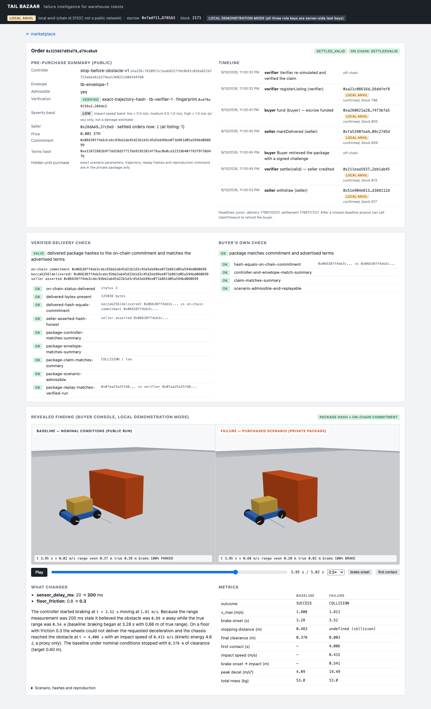

# Tail Bazaar — a marketplace for reproducible robot failure scenarios

> **Read this first.** Adversarially selected failures do not estimate real-world failure frequency.
> Simulation requires calibration against physical robots before supporting underwriting decisions.
> Tail Bazaar sells *failure discovery and replay*; it does not sell an insurance premium, a safety
> certification, or a probability. Severity is reported as an impact-speed proxy, never as a damage
> or dollar estimate. Nothing here is audited, Sybil-resistant, or production-ready.

Tail Bazaar is a Black Box Bazaar candidate (Blockchain at Berkeley take-home) built as a first step
toward **Loop**, a longer-term robotics-insurance idea. Autonomous *hunter* agents search the published
operating envelope of a fixed warehouse-cart controller for admissible conditions under which it
collides with an obstacle. A *verifier* re-simulates each claim in its own pinned environment,
publishes a coarse public summary, and registers a salted commitment to the private evidence package
on chain. A *buyer* agent funds an escrow without seeing the scenario, retrieves the package with a
signed challenge, and the verifier releases or refunds the payment.



## The question this market answers

> **Can this controller be deployed in a wider operating range than it was tuned for, and where
> exactly does it stop working?**

The controller under test documents the range it was tuned for in its own docstring
(`sim/tailbazaar_sim/controller.py`, "Design assumptions"). The envelope the hunter searches is
deliberately **wider** than that range:

| Axis | Group | Controller tuned for | Searched envelope | Nominal | Units |
|---|---|---|---|---|---|
| `sensor_delay_ms` | systems | ≤ 40 | 0 – 300 | 20 | ms (quantized to the 20 ms control tick) |
| `actuator_delay_ms` | systems | ≤ 20 | 0 – 100 | 20 | ms (quantized to the 20 ms control tick) |
| `floor_friction` | physical | ≥ 0.6 | 0.2 – 1.0 | 0.8 | coefficient |
| `payload_kg` | physical | = 20 | 5 – 60 | 20 | kg |

So a finding outside the tuned range is **not** a claim that the controller is broken where it was
designed to work. It is a measured boundary of how far the operating range can be widened before it
stops working. The demo's sold failure sits at `sensor_delay_ms = 200` and `floor_friction = 0.3`,
outside the tuned range on both axes and inside the searched envelope on every axis, and the UI says
so on the order page ("where this failure sits") rather than calling it a defect. The controller
checks none of its tuned-range assumptions at runtime; both ranges are illustrative design
assumptions, not measurements of a physical robot. Both ranges are published together in the listing
summary, on the order page and at `GET /api/envelope`; the exact parameters of a listing stay hidden
until it is bought.

## The vertical

Warehouse-robot developers (and, later, insurers such as Loop) buy **reproducible failure scenarios**:
exact conditions in a published operating envelope — wider than the range a controller version was
tuned for — under which that controller fails, with a replayable trajectory and enough environment
pins to reproduce it. The buyer cannot inspect the scenario before paying — that is the whole value —
so the market needs a verifier, a commitment scheme, and an escrow with deadlines.

Participants and incentives:

| Role | Does | Wants | Can cheat by |
|---|---|---|---|
| Seller (hunter) | searches the envelope, submits findings, delivers packages | payment per verified, distinct failure | claiming a failure that does not reproduce; delivering different bytes than committed; reselling near-duplicates |
| Verifier | re-simulates, publishes summaries, registers listings, adjudicates delivery | reputation as the market's oracle | colluding with a seller (mitigated only by transparency of its checks, not by the contract) |
| Buyer | selects by policy under a budget, funds escrow, retrieves, checks | verified findings for its controller at bounded cost | disputing a valid delivery (mitigated: a dispute is an event, not a refund) |

## What actually runs

```
sim/                MuJoCo cart + fixed controller + bounded hunter + canonical JSON (Python 3.12, uv)
sim/envelope.yaml   the searched envelope and the controller's tuned range, in GUARD's axis shape
contracts/          FailureEscrow.sol (Solidity 0.8.28, Foundry) + 22 tests
web/src/server/     Hono API, node:sqlite storage, seller/verifier/buyer agents, signed-challenge
                    delivery + hosted-mode gate, provenance, failure-ledger export, pipeline
web/src/client/     Three.js replay of recorded transforms (no second physics), listings, order timeline
scripts/            anvil, local deploy, cast flow, testnet deploy, ABI export
deploy/             start.sh, systemd unit, Caddy snippet for an Ubuntu VM
evidence/           milestone runs, local demo artifacts + ledger.json, UI captures, testnet receipts
```

1. **Seller discovery** — `sim/tailbazaar_sim/hunter.py`: a grid over sensor delay (0–300 ms) × floor
   friction (0.2–1.0), 144 MuJoCo simulations (~9 s). The controller and the scene are never modified;
   out-of-envelope scenarios are rejected before simulation. Collisions come from MuJoCo contact data,
   never from a script. Selection policy: mildest distinct collision first (smallest normalized
   distance to nominal, ties by impact speed), duplicates removed by the published rule
   (normalized L∞ distance < 0.05).
2. **Verifier** — `web/src/server/agents/verifier.ts`: admissibility, duplicate check against its
   failure ledger, claim must be a COLLISION, **re-run in the verifier's own pinned environment**, then
   exact trajectory-hash comparison when the environment fingerprint matches (same engine, NumPy,
   Python, platform, integrator, timestep, `uv.lock` hash) or metrics-within-tolerance otherwise
   (impact speed ±0.05 m/s, contact time ±0.05 s). Divergence → INCONCLUSIVE; non-reproduction,
   out-of-envelope, invalid initial state, duplicates → REJECTED. Then it checks the private package
   (canonical, hashes to the stated commitment, same scenario/trajectory/claim, 32-byte salt), writes
   the public summary, and calls `registerListing` — only the verifier address can.
   **Evidence binding** — the verifier only certifies what it actually re-ran, so a declared hash is
   never taken on trust:
   - the **claimed controller id and SHA-256** must equal the controller the verifier just re-ran
     (`claimed-controller-is-the-one-re-run`), so a real failure of one controller cannot be sold
     under another version's name;
   - the **trajectory hash is recomputed** from the delivered replay frames
     (`keccak256(canonical(frames))`) and compared with the declared field and with the verifier's own
     re-run (`package-frames-hash-to-declared-trajectory`,
     `package-frames-reproduce-verified-trajectory`), so frames altered behind an intact declared hash
     are rejected;
   - both checks run again on the bytes the seller actually serves at delivery
     (`delivered-frames-hash-to-verified-trajectory`, `delivered-controller-is-the-one-re-run`).

   Two tests drive exactly these two attacks through the real verifier and the real simulator and
   require a rejection (`web/src/server/__tests__/verifier-binding.test.ts`).
3. **Buyer** — `web/src/server/agents/buyer.ts`: deterministic policy, no model calls. Eligible =
   on-chain Listed, VERIFIED and admissible, controller id+hash and envelope id equal the buyer's
   target, price within the per-purchase cap (`BUYER_BUDGET_WEI`) and remaining budget. Ranking =
   severity band (high > medium > low), then lower price, then earlier listing. It funds escrow,
   signs the retrieval challenge, retrieves over HTTP, checks the package itself, and emits
   `requestRecheck` on chain if its check fails.
4. **Delivery and settlement** — the seller calls `markDelivered`; the verifier compares the delivered
   bytes with the on-chain commitment and the advertised summary and calls `settle(valid)`;
   payouts are pull-payments (`withdraw`).

The second listing in every demo run is delivered **tampered** (the seller alters the scenario after
the commitment was registered and still asserts the original hash). The verifier detects the
commitment mismatch, settles invalid, and the buyer withdraws the refund. This is a labeled
demonstration switch (`demo_tamper`), not a real dishonest seller.

## Quick start (local anvil, everything runs on this machine)

Prerequisites: Foundry 1.x, Node ≥ 22.13 (tested with 24), uv, Python 3.12 (uv fetches it),
Chrome-class browser for the UI.

```bash
cp .env.example .env                   # then put three TEST-ONLY keys in it (cast wallet new)
(cd sim && uv sync --frozen && uv run python -m tailbazaar_sim.cli --out ../evidence/local nominal)
(cd contracts && forge test)           # 22 tests
scripts/export-abi.sh                  # contracts/out -> web/abi/FailureEscrow.json
scripts/anvil-start.sh                 # anvil on :8545, funds the three test addresses (local ether)
scripts/local-deploy.sh                # writes ESCROW_ADDRESS_LOCAL into .env
scripts/local-flow.sh                  # whole state machine with cast (valid + invalid), before any web code
(cd web && npm ci && npm run build && npm test)                       # 22 unit tests (canonical JSON, envelope,
                                       # hosted-mode auth, verifier evidence binding; the last group re-runs the
                                       # simulator, so uv must be on PATH — no chain and no keys needed)
(cd web && npm run demo -- --reset --evidence ../evidence/local)      # seller -> verifier -> chain -> buyer, 2 orders
(cd web && npm run test:integration)   # 7 tests against the demo database + local chain
(cd web && npm run ledger)             # evidence/local/ledger.json for a GUARD-style pipeline (operator artifact)
scripts/server-start.sh                # http://127.0.0.1:3100  (scripts/server-stop.sh, scripts/anvil-stop.sh)
```

The UI has a "Run pipeline" button that does what `npm run demo` does, with a live log.

### Actual results in this repository

- Contract: 22/22 Foundry tests (success, invalid delivery, delivery and settlement deadline
  boundaries at exactly the deadline and one second after, unauthorized verifier, wrong buyer,
  seller funding own listing, repeated settlement, wrong payment, commitment mismatch, withdraw to a
  rejecting receiver, constructor and registration argument checks).
- Simulator: nominal suite 6/6 SUCCESS (clearance 0.318–0.394 m, target 0.40 ± 0.15); grid hunt 144
  runs, 101 SUCCESS, 43 COLLISION, 0 inconclusive; bitwise repeatability across in-process and
  subprocess runs in the pinned environment (`evidence/milestone/repeatability-*.json`).
- Web: 22 unit tests — canonical JSON (byte-identical re-serialization of Python-written run files and
  reproduction of their trajectory hashes), envelope and the published tuned range (which cannot drift
  from `controller.py` or `sim/envelope.yaml` without failing), hosted-mode access control, and the
  verifier's evidence binding (a mislabelled controller and altered replay frames behind an intact
  declared hash are both rejected by the real verifier against a real re-run, while the honest package
  still verifies) — and 7 integration tests (no private field leaks from any public endpoint;
  retrieval rejects the wrong signer, wrong binding, nonce replay, cross-order use and expiry;
  refunded orders are not retrievable; hosted mode closes the reveal route to visitors and a real
  signed retrieval reopens it).
- Local demo (`evidence/local/`): order 1 VERIFIED/VALID (exact trajectory hash, controller and
  delivered frames bound to the verifier's own re-run) → funded → delivered → retrieved → VALID →
  seller paid; order 2 tampered → COMMITMENT MISMATCH → recheck event → INVALID → buyer refunded.
  `evidence/local/ledger.json` is the exported failure ledger; UI captures in `evidence/ui/`.

## Base Sepolia (public testnet)

`scripts/testnet-deploy.sh` checks the deployer balance first and **exits 2 without deploying** when
the verifier wallet is unfunded — it then prints the three public addresses that need test ETH. When
funded it deploys with `forge create --broadcast`, verifies source on Sourcify and Blockscout (and
Basescan if `ETHERSCAN_API_KEY` is set), tops up the seller and buyer from the verifier wallet, runs
the same pipeline in `CHAIN_MODE=testnet`, and writes every receipt plus `evidence/testnet/TESTNET.md`
with explorer links. Test-only addresses (keys stay in the gitignored `.env`):

- verifier / deployer `0xe592C7DA96Cc42344952C452377eBCc7Cc0982AE` (needs ≈0.003 ETH; it funds the other two)
- seller `0x28dAA9F3F9468382fFeD53cc339418403337cDeD`
- buyer `0x1B27C90FcD738E960D3D505682EC2732A08c7f99`

**Status: deployed and exercised on Base Sepolia (chain id 84532).**

- FailureEscrow: [`0xfadf11662C46c0214B0A40938a26FB8f0CD785A3`](https://sepolia.basescan.org/address/0xfadf11662C46c0214B0A40938a26FB8f0CD785A3)
  — deployment tx [`0x1bbee5a5…f84fbc7d`](https://sepolia.basescan.org/tx/0x1bbee5a525cdeb642cb7058c3b26b4d1662fbd2549d22ea161c81394f84fbc7d),
  block 46669937; source verified on Basescan, Sourcify and Blockscout (logs in `evidence/testnet/`).
- Order 1 (valid): register → fund → markDelivered → settle(true) → seller withdraw; order 2 (tampered
  delivery): register → fund → markDelivered → buyer requestRecheck → settle(false) → buyer refund
  withdraw. All 14 transaction receipts (deploy, two top-ups, 12 flow transactions) are in
  `evidence/testnet/receipts/`, and `evidence/testnet/TESTNET.md` lists every hash with explorer links.
  Final state read back with `cast`: listing 1 = SettledValid, listing 2 = SettledInvalid, escrow
  balance 0, `settledOrders(seller)` = 1.
- Screenshots of the UI in testnet mode: `evidence/ui/testnet-*.png`.

A local anvil run never satisfies the assignment's testnet requirement; the UI labels every local
transaction "LOCAL ANVIL" and shows explorer links only for real Base Sepolia hashes. To browse the
testnet orders locally: `CHAIN_MODE=testnet scripts/server-start.sh` (each chain mode has its own
SQLite database under `web/data/`).

## Contract: `FailureEscrow` (native ETH, one listing = one order)

```
None ──registerListing(verifier only)──▶ Listed ──fund(exact price, not the seller)──▶ Funded
Funded ──markDelivered(seller, t ≤ deliveryDeadline)──▶ Delivered
Delivered ──settle(verifier, valid, t ≤ settlementDeadline)──▶ SettledValid | SettledInvalid
Funded ──claimTimeout(anyone, t > deliveryDeadline)──▶ Refunded
Delivered ──claimTimeout(anyone, t > settlementDeadline)──▶ Refunded
```

Terms are immutable once set: seller, buyer, verifier (contract-wide, immutable), exact price,
commitment, terms hash, and both deadlines (fixed at funding from the constructor windows). Exactly one
terminal transition per listing. `settledOrders[seller]` counts valid settlements and is what the UI
shows as seller history. `requestRecheck` is buyer-only and emits an event: a complaint never moves
funds, so a buyer cannot reclaim payment for valid data. **Buyer advantage (documented):** a silent
seller or a silent verifier resolves to a buyer refund after the deadline; the seller therefore depends
on a responsive verifier, and the verifier can never pay itself.

## Evidence format and commitment

Canonical JSON `tb-cjson-1` (specified in `sim/tailbazaar_sim/canonical.py`, ported in
`web/src/server/canonical.ts`, cross-checked by tests): UTF-8, keys sorted by code point recursively,
no insignificant whitespace, integral numbers as integer digits, other numbers as the shortest
round-trip decimal in plain positional notation (evidence floats are rounded to 6 places first),
NaN/Infinity rejected.

- **commitment** = `keccak256(canonical_bytes(private_package))`; the package carries a random
  32-byte `salt_hex`, so the commitment reveals nothing to someone who can guess the scenario.
- **terms hash** = `keccak256(canonical_bytes(public_summary))`; `listing_id = keccak256(commitment ‖ termsHash)`.
- **trajectory hash** = `keccak256(canonical_bytes(frames))`, where `frames` are per-tick body
  positions and quaternions of chassis, load and four wheels.

Private package schema `tb-package-1`: schema/format ids, salt, seller, controller id + SHA-256,
envelope id, engine and environment pins (MuJoCo, NumPy, Python, platform, integrator, timestep,
`uv.lock` hash), scene description, scenario, nominal scenario and changed conditions, advertised
claim, observed metrics, events, per-tick observations and commands, initial state, replay frames,
MJCF hash, and the reproduction command. Public summary schema `tb-summary-1` carries only controller
id + hash, envelope id, admissibility, verification status/verdict/method/verifier version/environment
fingerprint and what the verifier bound the evidence to, the coarse severity band, seller address,
seller settled-order count at listing, price, chain, and the operating context (the controller's tuned
range and the searched envelope in prose, plus the product question) — never parameters, trajectories,
nor any per-listing statement about where this scenario sits in the envelope, which would narrow it
down. Listings registered before the operating-context field existed keep the summary whose terms hash
is on chain; the UI falls back to `GET /api/envelope`, which states the same constants.

## Delivery authentication

`POST /api/challenges` issues a single-use nonce that expires in 300 s and is bound to order id, buyer
address, chain id and application domain, embedded in a human-readable message. The buyer signs it as an
EIP-191 personal message (viem `signMessage`). `POST /api/retrieve` recovers the signer, requires it to
equal the challenged buyer **and** the buyer bound to the order on chain, requires the on-chain status
to be Funded, Delivered or SettledValid, consumes the nonce, and only then returns the package bytes.
An address or a transaction hash alone never unlocks anything. Private packages exist only in
`private_packages`, `orders.delivered_bytes` and `retrievals` (SQLite under `web/data/`, gitignored) and
are never read by a public endpoint (tested).

### Hosted mode: what a public URL changes

Setting **`PUBLIC_BASE_URL`** means "this instance is reachable at a public URL" and switches the app
into **hosted mode**. Every route that can return private package bytes, private scenario parameters,
private trajectories or salts then requires an `Authorization: Bearer` token. **The mechanism chosen
is (a), the same signed-challenge buyer session used by the retrieval route**: a successful
`POST /api/retrieve` — which already proves control of the key the escrow records as this order's
buyer — returns a single-use-issued session token in the `x-tb-session` header, valid for one hour and
bound to that order. The **operator token** (`OPERATOR_TOKEN`, unset by default) is accepted as a
second path so the operator of a host can demonstrate their own deployment; with no token configured
no operator path exists and only buyer sessions open anything.

| Route | Local demonstration mode (`PUBLIC_BASE_URL` unset) | Hosted mode |
|---|---|---|
| `GET /api/orders/:id/reveal` (package bytes) | open to anyone who can reach the host | buyer session for **that order**, or operator token; otherwise **401** |
| `GET /api/runs/baseline` (a full recorded trajectory) | open | any live buyer session, or operator token; otherwise **401** |
| `POST /api/retrieve` | signed challenge | signed challenge (unchanged) |
| `POST /api/demo/run` (spends the operator's test ETH) | open unless `DEMO_TRIGGER_ENABLED=0` | **operator token only** |
| listings, orders, events, verifier checks, `GET /api/envelope`, status, balances | public projections only | unchanged |

The gate is `privateAccess()` in `web/src/server/index.ts`; every route in that file was audited
against it. The browser keeps a pasted token in `localStorage` and sends it as a bearer header to this
app only; the order page shows an "authentication required" panel instead of the replay when it has
none (`evidence/ui/hosted-reveal-locked.png`). Eight tests cover this
(seven in `web/src/server/__tests__/hosted-auth.test.ts`, plus one end-to-end case in the integration suite):
unauthenticated reveal → 401 with no bytes in the body, junk token → 401, session bound to another
order → 401, expired session → 401, operator token → 200, and the same reveal → 200 once a real signed
retrieval hands back a session. `DEMO_BUYER_CONSOLE=0` removes the reveal route entirely.
`deploy/start.sh` always exports `PUBLIC_BASE_URL`, so a host started through it fails closed.

### How a deployed version would authenticate users and limit automated spending

Local demonstration mode keeps all three keys on the server. A deployed marketplace would keep only
the verifier key server-side (ideally in an HSM/KMS), and buyers/sellers would sign with their own
wallets: the same challenge flow becomes a browser wallet signature (SIWE-style), and `fund` /
`markDelivered` / `withdraw` are sent from the user's wallet. Automated agents would run under
per-key budgets (a hard cap per purchase and per day, enforced before signing), an allowlist of
contract addresses and function selectors, nonce/replay protection, rate limits per key and per IP,
and a kill switch. The operator/verifier can see every payload, and buyers can redistribute what they
bought; TLS plus trusted server storage is the prototype's whole confidentiality model.

## Trust assumptions

- The **named verifier is the oracle**: the contract enforces authorization, payment, deadlines and one
  terminal settlement; it cannot check that a package is semantically correct. Verifier collusion or
  error is not prevented, only made visible (every check it ran is published after settlement).
- Reproduction is a claim **about the pinned environment** (`uv.lock` hash, MuJoCo 3.13.0, NumPy
  2.5.3, Python 3.12.13, single thread). Across machines the verifier falls back to metric tolerance;
  a seed alone is never assumed to guarantee reproducibility.
- The seller's hunter is trusted only for search; everything it claims is re-simulated, and the
  claimed controller hash and the delivered replay frames are re-derived from the bytes rather than
  believed (see "Evidence binding" above).
- The buyer trusts the public summary because the verifier signed the registration transaction; the
  summary's terms hash is on chain.
- The envelope, controller and severity bands are **illustrative assumptions**, not measurements of any
  physical robot. The tuned range is the controller author's documented assumption, not a certified
  limit.
- Confidentiality is **server-side trust plus TLS**, in both modes: the operator/verifier sees every
  payload and a buyer can redistribute what it bought. Hosted mode stops a *visitor* from reading paid
  evidence; it does not make the evidence confidential from the operator.
- Verdicts use GUARD's vocabulary — VALID (≡ the recorded status VERIFIED), INVALID (≡ REJECTED),
  INCONCLUSIVE. **INCONCLUSIVE never pays**: it is not a failed delivery, it is a refusal to certify.

## Biggest design decision

**Verifier-registered listings with re-simulation as the admission test.** Anyone can hash a JSON blob;
the scarce thing is a claim that a failure is admissible, distinct and reproducible. Letting only the
verifier call `registerListing` means a listing's existence *is* the verifier's statement that it
re-ran the scenario in its pinned environment and computed the commitment itself. That single choice
removes forged "verified" badges, makes the duplicate rule enforceable at admission time, and lets the
buyer's policy be a pure function of on-chain and summary data. The cost is centralization: the market
is only as honest as its verifier, which is why every verifier check is published and why the contract
never lets the verifier take funds.

## One important limitation

The physics is a **simplified cart** (rigid load, torque-model brake at physics rate, straight-line
motion, delays quantized to one 20 ms control tick) in an **illustrative envelope**. A collision here is
evidence about *this controller in this simulator*, not about a physical robot. Hunted failures are
adversarially selected, so their frequency says nothing about field failure rates, and the severity
proxy is uncalibrated. Loop-style underwriting would need calibration against physical robots and a
much richer scene model before any of this evidence could inform a premium.

## For Loop: what is reusable, and what this is not

Versioned scenario schema and envelope (`tb-envelope-1`), controller and engine identifiers, canonical
evidence hashing, admissibility checks, the verifier's failure ledger (`ledger` table with scenario,
trajectory hash, status and method), reproducible runs with environment pins, and the escrow/commitment
pattern for paying for evidence one cannot inspect first.

**What Tail Bazaar contributes to a GUARD-style underwriting pipeline, and what it explicitly does
not.** GUARD's job is a calibrated P(catastrophic) with error bars against a *stated* deployment
distribution D. Tail Bazaar produces the input such an estimator would consume, not the estimate: a
verified, reproducible, hash-committed **failure ledger** over a published θ envelope, each row
carrying physical severity proxies and full provenance. It explicitly does **not** produce failure
frequencies — the findings are adversarially selected by a search whose objective is to find failures,
so their number says nothing about how often anything fails in the field — it states **no distribution
D** over the axes (`sim/envelope.yaml` leaves GUARD's `marginal`/`scale` null on purpose, because
choosing D is a modelling decision that belongs to whoever prices the risk), it assigns no
biomechanical tier, damage estimate or monetary value, and the simulation needs calibration against
physical robots before any of it can support an underwriting decision.

The alignment is deliberate and named:

| GUARD | Tail Bazaar |
|---|---|
| `configs/guard_theta.yaml` axis schema (`name, low, high, nominal, marginal, scale, units, group`; groups physical/systems) | `sim/envelope.yaml`, same shape, served as JSON by `GET /api/envelope`; `marginal`/`scale` present and null (no D is stated) |
| `guard/severity.py`: limit state g(θ), `impact_energy = ½·m·v²` in joules | `limit_state_margin_m` (= the recorded `min_range_m`), `impact_speed_mps`, `impact_kinetic_energy_j`, `total_mass_kg` — measured, uncalibrated, no tier. GUARD's ISO/TS 15066 numbers are marked PLACEHOLDER_UNVERIFIED there and are not imported here |
| `guard/envelope.py` verdicts VALID / INVALID / INCONCLUSIVE | the same vocabulary on every verification and delivery (`verdict`), alongside the status names already recorded on chain: VERIFIED ≡ VALID, REJECTED ≡ INVALID. **INCONCLUSIVE never pays** |
| `guard/manifest.py` provenance: git SHA, dirty flag, resolved config, deterministic run id | `web/src/server/provenance.ts`: `git_sha`, `git_dirty`, `envelope_config_hash`, and `run_id` = a function of stage + resolved config only. Reported by `GET /api/status`, logged by every pipeline run, stamped on every ledger row |
| `guard/report.py` report rows | `evidence/<mode>/ledger.json` (`npm run ledger`), one row per finding: controller id + hash, envelope id, θ, per-axis in/out of the tuned range, limit-state margin, impact speed and energy, verdict and delivery verdict, `source` (bounded grid search / seeded random search), `search_cost`, `run_id`, provenance, environment pins, trajectory hash, commitment, on-chain settlement — plus a header with `n_nominal_runs`, `n_search_runs` and explicit `placeholder_warnings` |

The ledger export is **operator-facing only**: every row contains the scenario parameters buyers pay
for, so no HTTP route serves it (`npm run ledger -- <file>` writes it; the demo pipeline writes it into
its evidence directory).

`limit_state_margin_m` is the minimum recorded range to the obstacle; the simulator records no signed
penetration depth, so it does not go negative on contact and the `COLLISION` outcome remains the
authoritative failure flag. The simulator was not modified in this pass, so the GUARD field names are
applied in the export, not inside the run documents.

## Repository map, docs and licenses

- `STATUS.md` — simulator milestone report; `REPORT.md` — build report; `DEMO_SCRIPT.md` — 3-minute demo.
- `deploy/README.md` — Ubuntu VM hosting (systemd + Caddy); `deploy/start.sh` — hosting entry point.
- `ATTRIBUTION.md` — MuJoCo (Apache-2.0), Three.js (MIT), viem, Hono, Foundry and others. `LICENSE` — MIT.
- `sim/envelope.yaml` — the published envelope and tuned range in GUARD's axis shape;
  `evidence/local/ledger.json` — the exported failure ledger (operator artifact, written by
  `npm run ledger`).
- `.env.example` — every setting, including `PUBLIC_BASE_URL` (hosted mode) and `OPERATOR_TOKEN`;
  `.env`, databases and private packages are gitignored. Sample artifacts under `evidence/` are
  demonstration fixtures from this repository's own demo runs, not secrets — they do contain the
  scenarios those demo listings sold.
