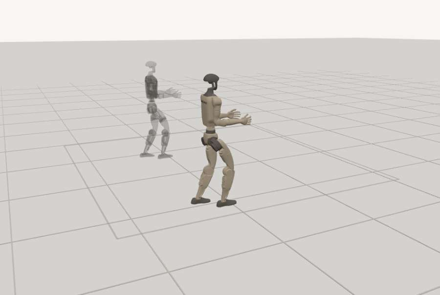

# Tail Bazaar

A marketplace for reproducible robot failures. Hunter agents find the conditions that break a robot's controller. A verifier re-runs the physics. The buyer pays into escrow before looking, and the seller is paid only when the delivered evidence hashes to the sealed commitment.

**Live:** https://tailbazaar.duckdns.org · **Contract:** [`0xfadf11662C46c0214B0A40938a26FB8f0CD785A3`](https://sepolia.basescan.org/address/0xfadf11662C46c0214B0A40938a26FB8f0CD785A3) on Base Sepolia (chain id 84532), source verified · **Full write-up:** [docs/README-full.md](docs/README-full.md)

| Unitree G1 under Unitree's own pretrained policy | 28 N·s from the side: down at 2.7 m/s |
|---|---|
|  |  |


Recorded simulator trajectories drawn in the browser. The grey ghost is the same policy at nominal conditions.

## The four answers

- **Vertical.** Robot-controller testing: hunters sell failure scenarios, operators and insurers buy them, and the buyer cannot inspect a scenario before paying because inspecting it is having it.
- **Trust assumptions.** One verifier, trusted for the verdict, constrained by the contract: only it lists and settles, it can never take funds, and every check it ran is published. The pinned simulator is the ground truth. Sellers and buyers are untrusted.
- **Biggest design decision.** A listing exists on chain only after the verifier has re-simulated the scenario itself and computed the commitment. The listing *is* the verifier's statement that the failure reproduces.
- **One important limitation.** Adversarially selected failures are not failure frequencies, the simulations are uncalibrated research models, and the contract is unaudited.

## How a trade works

Hunt → verifier re-runs and registers the listing (commitment + terms hash) → buyer checks the terms against the chain and funds the price → seller delivers, buyer retrieves with a wallet-signed single-use challenge → verifier checks the bytes against the seal and the run record against its re-run → one settlement: seller paid or buyer refunded. One hour to deliver, two to settle, then anyone can trigger the refund. Every unsold finding has a **Buy** button and every robot a **List a new finding** button; both run live against the chain.

Four robots: a warehouse cart, a Gymnasium humanoid, a Fetch arm, a Unitree G1. Tests: 22 contract, 120 application, 13 integration. 13 orders settled on Base Sepolia.

```bash
scripts/anvil-start.sh && scripts/local-deploy.sh
(cd web && npm ci && npm run build && npm run demo -- --reset)
scripts/server-start.sh      # http://127.0.0.1:3100
```

MIT. A research prototype: not audited, not Sybil-resistant, not a safety certification.
