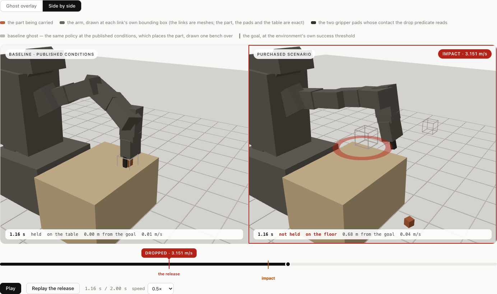
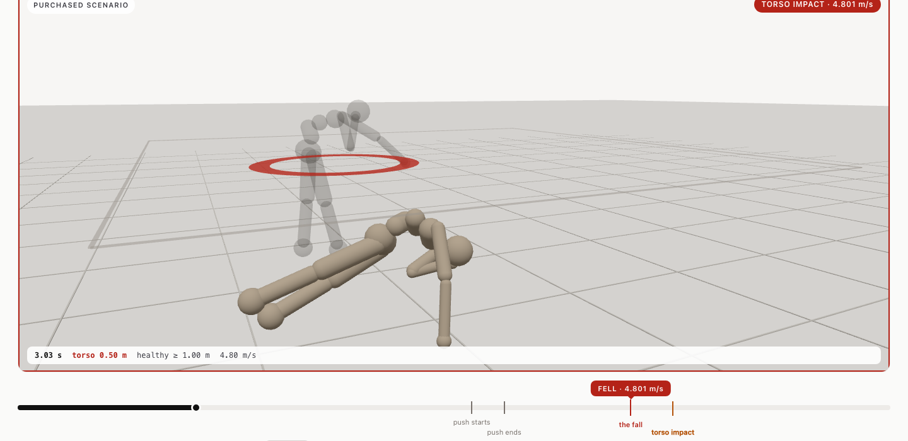
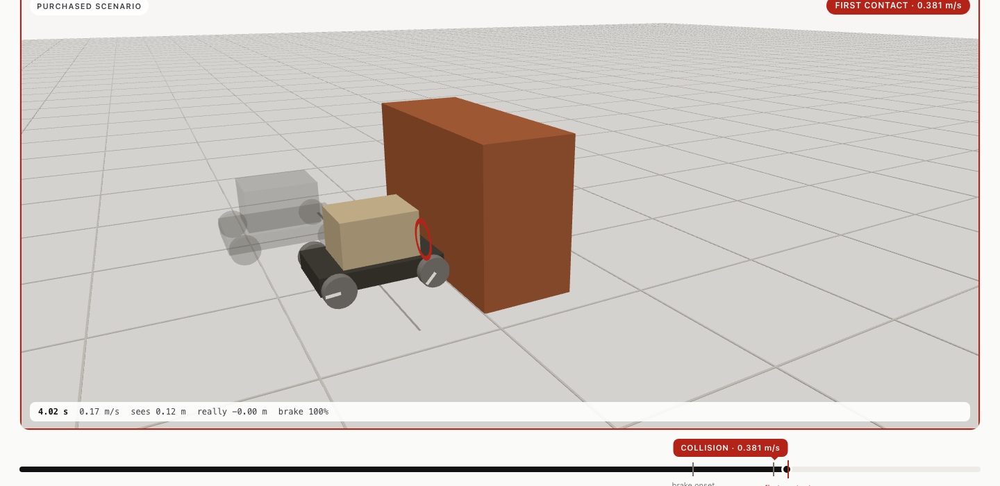

# Tail Bazaar — a marketplace for reproducible robot failure scenarios

> **The four answers the brief asks for (the rest of this file is the evidence).**
>
> **Vertical.** Robot-controller testing. Sellers are *hunter* agents that search a robot's published operating envelope for the exact conditions under which its controller fails; buyers are the people who ship or insure that controller. The good is a reproducible failure scenario the buyer cannot inspect before paying, because inspecting it *is* having it. Three robots are on sale: a warehouse cart, a pretrained humanoid balance policy, a pretrained manipulator pick-and-place policy, each with its own definition of "it failed" (details under each target below).
>
> **Trust assumptions.** One verifier, trusted for the verdict and constrained by the contract: only it can register a listing or settle, it can never take funds, it settles once, and every check it ran is published after settlement. The simulator is the ground truth, pinned by an environment fingerprint; a re-run that does not match is INCONCLUSIVE, never VALID. Sellers and buyers are untrusted: sealed commitments, re-simulation, a physical-plausibility bound on delivered frames, and wallet-signed single-use retrieval challenges. Full section: [Trust assumptions](#trust-assumptions).
>
> **Biggest design decision.** Listings are registered on chain only by the verifier, after it has re-simulated the scenario itself and computed the commitment: a listing's existence *is* the verifier's statement that the failure reproduces. Money moves only when the delivered bytes hash to that commitment. Full section: [Biggest design decision](#biggest-design-decision).
>
> **One important limitation.** Adversarially selected failures are not failure frequencies: the hunters are built to find failures, so nothing here says how often anything fails in the field, and the simulations are uncalibrated research models. The contract is unaudited. Full section: [Limitations, stated plainly](#limitations-stated-plainly).
>
> **Live:** https://tail.170-9-57-94.sslip.io · **Contract:** `FailureEscrow` at [`0xfadf11662C46c0214B0A40938a26FB8f0CD785A3`](https://sepolia.basescan.org/address/0xfadf11662C46c0214B0A40938a26FB8f0CD785A3) on Base Sepolia (chain id 84532), source verified · **Video script:** `DEMO_SCRIPT.md`.

> **Read this first.** Adversarially selected failures do not estimate real-world failure frequency.
> Simulation requires calibration against physical robots before supporting underwriting decisions.
> Tail Bazaar sells *failure discovery and replay*; it does not sell an insurance premium, a safety
> certification, or a probability. Severity is reported as an impact-speed proxy, never as a damage
> or dollar estimate. Nothing here is audited, Sybil-resistant, or production-ready.

Tail Bazaar is a Black Box Bazaar candidate (Blockchain at Berkeley take-home) built as a first step
toward **Loop**, a longer-term robotics-insurance idea. Autonomous *hunter* agents search the published
operating envelope of a fixed robot controller for admissible conditions under which it fails. A
*verifier* re-simulates each claim **with that robot's own simulator** in its own pinned environment,
publishes a coarse public summary, and registers a salted commitment to the private evidence package
on chain. A *buyer* agent funds an escrow without seeing the scenario, retrieves the package with a
signed challenge, and the verifier releases or refunds the payment.

**The marketplace is multi-target.** Three robots are listed today:

| Target | The machine | What "failure" means | Who decides that | Severity proxy |
|---|---|---|---|---|
| `cart` (`tb-envelope-1`) | a braking warehouse cart carrying a payload | `COLLISION` — it reaches the obstacle instead of stopping short; `LOAD_SHED` — the payload breaks loose under braking | the simulator's own contact flag / slip criterion | impact speed (m/s) |
| `humanoid` (`tb-humanoid-envelope-1`) | a 42.116 kg Gymnasium MuJoCo humanoid under a pretrained SAC balance policy | `FELL` — the torso leaves the height band the environment calls healthy | **Gymnasium's own health predicate**; this project implements no fall detector | torso impact speed (m/s) |
| `arm` (`tb-arm-envelope-1`) | a Gymnasium-Robotics MuJoCo Fetch arm picking a 5 cm block off a table under a pretrained SAC+HER policy | `DROPPED` — the part leaves the gripper in mid-air, away from the goal; `NOT_PLACED` — it is still not at the goal when the episode ends | `NOT_PLACED` is **Gymnasium-Robotics' own success flag**; `DROPPED` is **this project's own mechanical predicate over MuJoCo's contact list**, because the environment scores placement and not custody | the part's impact speed (m/s); `NOT_PLACED` deliberately has **none** |
| `g1` (`tb-g1-envelope-1`) | Unitree's own 32 kg 12-dof MuJoCo model of the G1 humanoid walking under Unitree's own pretrained policy (`unitree_rl_gym`, BSD-3-Clause) | `FELL` — the pelvis drops below 0.462 m or tilts past 60° | **this project's own predicate, stated in every run document**, because Unitree's runner has no fall flag | pelvis impact speed (m/s) |

Everything target-specific lives in one registry, `web/src/server/targets.ts`: id, label, envelope
YAML, simulator entry point and CLI shape, failure classes, severity proxy and units, the
physical-plausibility derivation, and a replay-renderer id. Adding the third robot was one entry
there plus one renderer; no agent, route, ledger row or page needed a special case.





## The experience

Three places to be: the **marketplace**, one **finding**, and **how it works** — what the verifier
actually checks and what each verdict does to the money. Every page opens with one plain-language
sentence. Hashes, canonical JSON, envelope tables, provenance and raw metrics stay complete and
reachable but sit behind labelled disclosures ("Show the verifier's checks", "Show provenance"), so
they are never the first thing a visitor reads. A finding is told in five stages down the page — the
sealed claim, the purchase, the reveal, the evidence, the settlement — with a sticky rail to move
between them, and the on-chain history reads as one sentence per transaction with real explorer
links rather than a log dump.

**Seeing the failure.** The replay opens **0.6 s before the failure moment** and plays through it
once on load, instead of resting at the parked end of the run. Both viewports share **one camera
anchor**, so baseline and failure are literally the same framing and both subjects stay in frame (the
replay handle exposes `visibility()`, and the headless captures assert it). By default the surviving
nominal baseline is drawn inside the failure viewport as a translucent **ghost** — one lane over, its
position *along* the track exact — so "survives" and "does not" are visible in one frame; side by
side stays as a toggle. The moment itself gets an expanding ring, a short hold and slow motion
through it, a persistent callout carrying the measured severity anchored to that instant on the
scrubber, and ticks for every cue the run recorded. `prefers-reduced-motion` disables every entrance
reveal, counter and hover lift, and opens the replay **paused on the failure frame** instead of
autoplaying. The renderer consumes only the saved simulation transforms; it runs no physics.

**One engine, one renderer per robot** (`web/src/client/replay.ts` + `replay-cart.ts` /
`replay-humanoid.ts` / `replay-arm.ts`). The cart renderer draws the boxes and cylinders the run's
`scene` block publishes. The humanoid and arm renderers draw the MJCF primitives the run publishes in
`scene.render_bodies` — one capsule, sphere or box per geom, each posed *local* to a named body — and
pose those bodies from the recorded world transforms. Nothing about either robot is hard-coded in the
browser: the body list, the shapes, their sizes and their offsets all come out of the run document,
which is the same contract `render.py` consumes on the Python side. The humanoid renderer also draws
the environment's own **healthy-height floor** as a thin outline at `healthy_z_range[0]`, because that
line *is* the failure definition, and the HUD turns the torso height warm-red below it. The arm
renderer draws **solid** bodies, deliberately: the evidence PNGs in `evidence/arm` are wireframes, and
a wireframe cannot answer the only question this failure asks — is the part in the hand or not. It
reads three things out of the run rather than assuming them: the `role` field, so MuJoCo's mocap
gizmo (three 2 m bars that collide with nothing) is skipped instead of drawing a coordinate cross
through every frame; `box_half_extent_m` plus its own `proxy` note, because the arm's links are meshes
the run document cannot carry (each link shows that box only until the robot's own STL, served beside
the page, replaces it) while the part, the pads, the table and the floor are exact boxes
and planes; and the goal, which is a *site* rather than a body and so travels beside the frames — it
is drawn as an open cage at the environment's own success threshold, never a solid, because a filled
box at the goal would read as an obstacle. Its ghost is the bench, the part and the gripper, not a
second translucent arm. Frames stay small: the humanoid records at a stride of 2 (33.3 Hz, 4 decimal
places), so a 3 s fall is 119 KB and the 15 s survivor 404 KB; the arm records at the control rate
with no decimation, 20 bodies and 24 primitives in 73 KB for the whole drop.

**The 3D palette is neutral and warm, with exactly one colour that means something.** Charcoal
chassis, sand load, terracotta obstacle, mid-grey wheels, humanoid in a neutral warm stone, graphite
arm links with darker gripper pads over a sand work surface, the carried part in the same terracotta
the cart's obstacle uses, off-white floor with a faint graphite grid. The single warm red (`--alert`, the same one the page uses for
every piece of failure evidence) is reserved for the contact ring and the callout; the baseline ghost
is a translucent graphite so "what should have happened" reads as absent rather than as a second
subject. **There is no blue in any viewport** (`web/src/client/palette.ts`).

**The failure class is data, not code** (`web/src/server/failure.ts`). A run document names its own
class in `outcome`, and the page derives the readable name, the failure moment, the number that
summarises it and its unit, the scrubber marks and the scene annotation from that run's own events
and metrics. `COLLISION`, `LOAD_SHED`, `FELL`, `DROPPED` and `NOT_PLACED` are each narrated from their own
recorded event and their own severity proxy — including one that has none, because the arm's
`NOT_PLACED` has nothing to measure and says so rather than inventing a number; a run that fails two
ways keeps both moments and both badges; a class with no entry in the copy registry still gets a
readable name and its own moment, with no UI change. Even which field names the event is read from
the document (`type` on two simulators, `event` on the third) rather than assumed.

**Both ranges are graphical**: one bar per axis showing the envelope the hunter searched, the range
the controller was tuned for inside it, the nominal operating point, and — post-purchase only — where
this finding sits. The pre-purchase view never renders the finding marker, because that marker is
derived from the exact parameters.

**The marketplace is grouped and filterable by robot.** The page opens with the three machines side
by side — what each one is, what "failure" means for it, who decides that, its severity definition,
both published ranges, and what the hunters have already spent searching it — before any mechanism is
explained; the findings list below is grouped by robot with `All / Cart / Humanoid / Arm` filters.
Nothing on that page counts the robots by hand: the copy is built from whatever the registry
publishes at `GET /api/market`.

Captures: `evidence/ui/marketplace.png`, `order-arm-dropped.png`, `order-cart-collision.png`,
`order-humanoid-fell.png`, `replay-arm-drop.png`, `replay-arm-split.png`, `replay-cart-impact.png`,
`replay-humanoid-impact.png`, `order-invalid-refund.png`,
`how-it-works.png`, `hosted-reveal-locked.png`, and the Base Sepolia run in the pre-multi-target UI
(`testnet-*.png`).

## The question this market answers

> **Can this controller be deployed in a wider operating range than it was tuned for, and where
> exactly does it stop working?**

The same question, once per robot. Each target's author documented the conditions the artefact was
built for; the envelope the hunter searches is deliberately **wider** than that, so a finding outside
those conditions is a measured boundary of the deployable range, never a defect report. Both ranges
are published together in every listing summary, on the order page, and at `GET /api/envelope` (one
document per target); the exact parameters of a listing stay hidden until it is bought.

### Target 1 — the warehouse cart (`tb-envelope-1`)

The controller under test documents the range it was tuned for in its own docstring
(`sim/tailbazaar_sim/controller.py`, "Design assumptions"). The envelope the hunter searches is
deliberately **wider** than that range:

| Axis | Group | Controller tuned for | Searched envelope | Nominal | Units |
|---|---|---|---|---|---|
| `sensor_delay_ms` | systems | ≤ 40 | 0 – 300 | 20 | ms (quantized to the 20 ms control tick) |
| `actuator_delay_ms` | systems | ≤ 20 | 0 – 100 | 20 | ms (quantized to the 20 ms control tick) |
| `floor_friction` | physical | ≥ 0.6 | 0.2 – 1.0 | 0.8 | coefficient |
| `payload_kg` | physical | = 20 | 5 – 60 | 20 | kg |
| `load_friction` | physical | not stated | 0.1 – 1.0 | 0.6 | coefficient (deck grip; added with the `LOAD_SHED` class) |

`load_friction` is the one axis for which the controller's docstring states no tuned range, so a
finding cannot be inside or outside it; the UI's range bar for that axis draws the searched envelope
only and says so. The controller checks none of its tuned-range assumptions at runtime; both ranges
are illustrative design assumptions, not measurements of a physical robot.

### Target 2 — the humanoid balance policy (`tb-humanoid-envelope-1`)

> **This policy is published with a mean return of 8127 on stock Humanoid-v5. How far can the
> operating range be widened — a shove, a slippery floor, a heavier body, noisy or delayed
> actuation — before it falls over?**

The artefact under test is a **pretrained policy somebody else trained and published**. Nothing in
this project trains, fine-tunes or scripts anything; the checkpoint is treated exactly the way the
cart target treats `controller.py` — a fixed artefact pinned by hash, never edited, whose operating
range is the product question.

| | |
|---|---|
| Hugging Face repo | [`farama-minari/Humanoid-v5-SAC-expert`](https://huggingface.co/farama-minari/Humanoid-v5-SAC-expert/tree/f9130b25c70584670ceac33eb1d06fbc418d691a) |
| Pinned revision | `f9130b25c70584670ceac33eb1d06fbc418d691a` (a commit, not `main`) |
| Archive / weights | `humanoid-v5-sac-expert.zip` 7 179 847 B, sha256 `5a7b38be…18cd6`; `policy.pth` 3 222 902 B, sha256 `6437d3dd…3e18ef` |
| Actor-tensor digest | `1a1eb409…8fe311` — sha256 over exactly the six tensors used for control. **This is what a listing is bound to**, so a real failure of one checkpoint cannot be sold under another one's name |
| Algorithm / network | SAC (Stable-Baselines3 2.4.0a10), MLP 348 → 256 → 256 → 17, ReLU, tanh-squashed, deterministic mean action |
| Publisher's claim | `mean_reward 8127.00 ± 46.46` over 10 deterministic episodes |
| Environment | Gymnasium `Humanoid-v5`, **unmodified** `humanoid.xml`, 42.116 kg, 17 actuators |

All four digests are checked **at load time**, not merely recorded. The weights are evaluated in
numpy (a restricted unpickler reads the `.pth` container directly), so torch is not a run-time
dependency; the reimplementation reproduces the publisher's own number — measured mean return
**8112.91** against the claimed 8127.00 ± 46.46.

| Axis | Group | Publisher evaluated at | Searched envelope | Nominal | Units |
|---|---|---|---|---|---|
| `push_impulse_ns` | physical | = 0 | 0 – 120 | 0 | N·s (constant world-frame force held 0.15 s on the torso) |
| `push_heading_deg` | physical | not stated | 0 – 360 | 0 | deg (circular) |
| `push_time_s` | physical | not stated | 0.6 – 7.8 | 2.1 | s (quantized to the 15 ms control tick) |
| `floor_friction` | physical | = 1.0 | 0.4 – 1.4 | 1.0 | coefficient |
| `body_mass_scale` | physical | = 1.0 | 0.8 – 1.25 | 1.0 | coefficient (mass **and** matching inertia) |
| `actuator_noise_frac` | systems | = 0 | 0 – 0.3 | 0 | fraction of the actuator half-range |
| `control_latency_ms` | systems | = 0 | 0 – 90 | 0 | ms (quantized to the 15 ms control tick) |
| `init_seed` | physical (discrete) | not stated | {0…7} | 0 | a **stratification**, not a coordinate: two runs from different initial states are never duplicates |

**The failure class is the environment's, not ours.** `FELL` is the `terminated` flag Gymnasium's
`HumanoidEnv` computes from its own `is_healthy` property — the torso height left
`healthy_z_range = (1.0, 2.0) m`. The simulator cross-checks `terminated == (not env.is_healthy)` at
every control tick; across all 293 simulations in `evidence/humanoid/` the mismatch count is **0**.
Severity is `torso_impact_speed_mps`, the torso's world-frame linear velocity at the first floor
contact of a geom that is not a foot, looked for only *after* the predicate fires. The coarse bands
are anchored to the only non-arbitrary speed the scene offers: `sqrt(2·g·1.0 m) = 4.43 m/s`, a free
fall from the height at which the environment already calls the torso unhealthy — low below half of
it, medium up to it, high above it. It is kinematics, not damage, injury or cost.

**Licence — the one constraint this work could not fully satisfy.** *(Copied honestly from
`evidence/humanoid/README.md` §1.)* **The model repository declares no licence**: no `license:` field
in its card metadata, no `license:*` tag, no `LICENSE` file. Alternatives were checked —
`sb3/sac-Humanoid-v3`, the `cleanrl`/`sdpkjc` Humanoid-v4 checkpoints (all undeclared), and
`hwihwalab/neuromotion-humanoid-v5-ppo`, which is MIT but whose own card reports mean survival of
**88.5 control steps (≈1.3 s)**, so it does not balance and cannot be a balance target. The choice
was between an unlicensed policy that works and a licensed one that does not. What this project does
instead of asserting a licence it does not have: the weights are **downloaded at run time, never
vendored into this repository, never modified and never redistributed** — only their sha256 digests
and the measured behaviour are published; the publisher is named and linked everywhere the policy
appears; and `policy.py::LICENCE_NOTE` records exactly what was checked, with `declared_spdx: null`.
The Farama Foundation's own source projects are MIT and it publishes these checkpoints as the
behaviour policies behind its Minari datasets, but that licence is **not restated on the model
repository**, so none is asserted here on its behalf. **Anyone redistributing these weights should
resolve the licence with the publisher first.**

Full provenance, the nominal suite, every hunt and the repeatability checks:
[`evidence/humanoid/README.md`](evidence/humanoid/README.md).

### Target 3 — the manipulator pick-and-place policy (`tb-arm-envelope-1`)

> **This policy is published as placing the block in about ten control steps, every episode. How far
> can the operating range be widened — a heavier part, a slipperier one, a part that is not quite
> where it was expected, noisy or delayed actuation — before it drops what it is carrying?**

The artefact under test is again a **pretrained policy somebody else trained and published**, pinned
by hash and never edited. The scene is Gymnasium-Robotics' shipped `fetch/pick_and_place.xml`,
compiled unmodified: a Fetch arm driven by a **mocap weld** on its end effector, a table whose top
sits at z = 0.400 m, a 5 cm cube resting on it, and a goal the environment samples itself — in the
air about half the time.
The replay draws the arm from the robot's own link meshes — the 15 Fetch STLs the environment's MJCF names, copied verbatim from Gymnasium-Robotics into `web/public/meshes/fetch/` with their licence notice — posed under each recorded body at the MJCF geom frame; the part, the pads and the table stay the exact boxes the run publishes.

| | |
|---|---|
| Hugging Face repo | [`IntelliGrow/FetchPickAndPlace-v4`](https://huggingface.co/IntelliGrow/FetchPickAndPlace-v4/tree/04bb1bf735f6a2957d8b77d185afe46ba112357a) |
| Pinned revision | `04bb1bf735f6a2957d8b77d185afe46ba112357a` (a commit, not `main`) |
| Archive / weights | `sac-FetchPickAndPlace-v4.zip` 3 374 885 B, sha256 `2b1b30dd…be1481`; `policy.pth` 1 520 771 B, sha256 `79250646…d710ea` |
| Actor-tensor digest | `09a0e01d…90feaa` — sha256 over exactly the six tensors used for control. **This is what a listing is bound to** |
| Algorithm / network | SAC + Hindsight Experience Replay (Stable-Baselines3 2.7.0), `MultiInputPolicy`, MLP 31 → 256 → 256 → 4, ReLU, tanh-squashed, 75 012 parameters |
| Publisher's claim | `mean_reward −9.70 ± 4.17` over 10 deterministic episodes |
| Environment | Gymnasium-Robotics `FetchPickAndPlace-v4`, **unmodified** MJCF, episode horizon 50 control ticks at 25 Hz |
| **Licence** | **`declared_spdx: null` — NOT DECLARED.** See below. |

All four digests are checked **at load time**. The weights are evaluated in numpy with the same
restricted unpickler written for the humanoid target (imported, not copied), so torch is not a
run-time dependency, and the reimplementation reproduces the publisher's own number: measured mean
return **−12.00** over the four published-conditions episodes against the claimed −9.70 ± 4.17,
inside the publisher's own quoted spread.

| Axis | Group | Publisher evaluated at | Searched envelope | Nominal | Units |
|---|---|---|---|---|---|
| `object_mass_kg` | physical | = 2.0 | 0.2 – 20.0 | 2.0 | kg (inertia scaled by the same ratio, so only the scale moves) |
| `grip_friction` | physical | = 1.0 | 0.02 – 1.5 | 1.0 | coefficient, written on the block **and both finger pads** |
| `object_offset_x_m` | physical | = 0 | −0.05 – 0.05 | 0 | m (applied after the environment samples its own initial state) |
| `object_offset_y_m` | physical | = 0 | −0.05 – 0.05 | 0 | m |
| `action_noise_frac` | systems | = 0 | 0 – 0.5 | 0 | fraction of the action half-range |
| `control_latency_ms` | systems | = 0 | 0 – 160 | 0 | ms (quantized to the 40 ms control tick) |
| `gripper_latency_ms` | systems | = 0 | 0 – 160 | 0 | ms, on the gripper channel **only**, on top of the control latency |
| `init_seed` | physical (discrete) | not stated | {0…7} | 0 | a **stratification**: each seed is a different block placement *and* a different goal |

Two axes are worth restating. `object_mass_kg` is a **payload** axis, not a material: the shipped 5 cm
cube at 2 kg is already 16 000 kg/m³, denser than lead, so the stock object is not realistic either
and the 20 kg bound is deliberately past the interesting region. `grip_friction` is written on the
block **and both pads** because MuJoCo combines a contact pair's friction with the *maximum* of the
two geoms — lowering only the block would change nothing while the pads still carried 1.0.

**Who owns which predicate.** `SUCCESS` / `NOT_PLACED` is the environment's own `info["is_success"]`
at its own registered horizon; this project implements no placement detector and cross-checks the
flag at every tick against the distance recomputed from the environment's own `achieved_goal` and
`desired_goal` — **0 mismatches across all 325 simulations** in `evidence/arm/`. `DROPPED` is the one
predicate **this project owns**, and it is stated rather than hidden, because the environment scores
*placement* and not *custody*: a release is proposed when the block was touching both finger pads,
was more than 0.03 m above where it rests on the table, is no longer touching them, and is not at the
goal — and is **confirmed** only if the grasp is not regained within three further control ticks.
That confirmation is not cosmetic: the first grid sweep produced a "drop" in which the block was
rising steadily at a constant 0.67 m/s with one 40 ms tick of one pad's contact missing while it was
still firmly pinched. With the window, `grid-grip` went from 7 "drops" to **4 real ones**, and the
withdrawn proposals are recorded in the run document (and marked on the replay scrubber) rather than
discarded silently. Severity is `object_impact_speed_mps`, the block's world-frame speed at the last
control tick at which it was still unsupported, banded against the only non-arbitrary speed the scene
offers: `sqrt(2·g·0.4 m) = 2.80 m/s`, a free fall from its own table top to the floor. `NOT_PLACED`
carries **no severity proxy at all** — nothing was dropped and nothing hit anything, so an invented
stand-in would look like a severity and would not be one.

**The honest negatives, and why they are in the README rather than buried.** Across 325 simulations
(325 320 physics steps, 9.4 s, 20 drops, 0 inconclusive):

- **Payload mass alone never costs the grasp: 48 of 48 placed**, at every one of the eight geometries,
  up to 20 kg — ten times the published mass.
- **Moving the part alone never costs it either: 25 of 25 placed**, up to ±5 cm on both axes, a third
  of the environment's own sampling range. The policy observes the block's pose, so it goes where the
  block is.
- **The latency × noise grid produced not one drop** (30 simulations). Noise alone, up to half the
  full command range, fails nothing; latency at 120 ms and above fails to *place* almost everywhere.
  The systems axis costs this policy the **placement**, not the **part** — the opposite shape from the
  humanoid target, where one 15 ms tick of latency put it on the floor. Reported as measured.
- Failure is also **not monotone in friction and is concentrated in the geometry**: five of the eight
  pick-and-place problems place the block at every friction down to 0.02, fifty times slipperier than
  the policy ever saw. A single friction threshold would have been a more sellable answer and a false
  one.
- What *does* drop it is a **combination**: 15 of the 16 drops in the 150-draw random sweep are at a
  block mass of 5 kg or more, even though mass on its own does nothing. That is the finding a
  single-axis sweep could not have produced.

The finding this repository lists first is the mildest one: `grip_friction 0.25` on `init_seed 3`,
one axis moved, distance to nominal 0.5068. The arm lifts the block, carries it to within **0.053 m**
of the goal — a whisker outside the environment's own 0.05 m threshold — lets go **0.68 s** in at
**0.151 m** above the table, and the block clears the table edge and hits the **floor** at
**3.151 m/s**. Trajectory hash `0xc34cf117…`, byte-identical across three in-process re-runs plus a
fresh subprocess on two independent digests.

**Licence — the same constraint the humanoid target hit, and it could not be solved here either.**
**The model repository declares no licence**: no `license:` field in its card metadata, no
`license:*` tag, no `LICENSE` file — and **neither does any other FetchPickAndPlace checkpoint found
on the hub**. Six were checked one by one (`IntelliGrow/FetchPickAndPlace-v4`,
`sb3/tqc-FetchPickAndPlace-v1`, `hhmm1122/fetch-pickandplace-sac-her`,
`crislmfroes/tqc-FetchPickAndPlace-v2`, `Edgar404/td3-FetchPickAndPlaceDense-v2-v3`,
`qgallouedec/tqc-FetchPickAndPlace-v1-3795610126`) and **all six declare nothing**; there was no
licensed alternative to switch to. The weights are **downloaded at run time, never vendored into this
repository, never modified and never redistributed** — only their sha256 digests and the measured
behaviour are published; the publisher is named and linked everywhere the policy appears; and
`policy.py::LICENCE_NOTE` records exactly what was checked, with `declared_spdx: null`. **Anyone
redistributing these weights should resolve the licence with the publisher first.** The **scene** is a
different matter and is properly licensed: Gymnasium-Robotics is **MIT** (Farama Foundation), and the
Fetch MJCF it ships carries that licence.

One compatibility shim exists and is proved rather than asserted: Gymnasium-Robotics 1.4.2 cannot
build a Fetch environment on MuJoCo 3.13.0 at all, because four of its joint-slot assertions test a
numpy `int32` for membership in a tuple of pybind11 enum members. `arm/compat.py` rebinds one module
global to a proxy whose `mjtJoint` members are plain ints; it reproduces no upstream logic, changes no
numeric behaviour, refuses to apply to any other Gymnasium-Robotics version, and `compat.verify()`
(run by `arm.cli selfcheck`) writes known values through the patched accessors and compares them
against `data.qpos` read directly — **7/7 checks pass**, with `bug_present_without_shim: true`
recorded so a future fix fails loudly. Every run document carries the shim's `scene.compat_shim`
block.

Full provenance, the nominal suite, every hunt, the drop-predicate hardening and the repeatability
checks: [`evidence/arm/README.md`](evidence/arm/README.md).

### Target 4 — the Unitree G1 walking policy (`tb-g1-envelope-1`)

> **Unitree ships this walking policy with one MuJoCo deployment configuration and no envelope. How
> far can the operating range be widened — a shove, a slippery floor, a heavier body, noisy or
> delayed actuation, a faster or slower command — before the G1 falls over?**

The artefact under test is **Unitree's own pretrained G1 walking policy**, `deploy/pre_train/g1/motion.pt`
from [`unitreerobotics/unitree_rl_gym`](https://github.com/unitreerobotics/unitree_rl_gym/tree/276801e46c5d433564f24658bac64f254b7d2d4b)
at commit `276801e4`, **BSD-3-Clause** (the licence text is vendored beside the files). It is a
TorchScript module — an LSTM(47 → 64) memory feeding a 64 → 32 → 12 ELU actor — run under Unitree's
own 12-dof MuJoCo model of the G1 (`g1_12dof.xml`, 32.1 kg, the arms, torso and head folded into
one rigid pelvis body) with Unitree's own deployment configuration (`deploy_mujoco/configs/g1.yaml`:
0.002 s physics, 50 Hz control, PD gains, default joint angles, observation/action scales, a 0.5 m/s
forward command). `sim/tailbazaar_sim/g1/simulate.py` is a line-by-line port of the publisher's
`deploy_mujoco.py` control loop; the policy file's sha256 `cf668f75…1759d` is checked at load time
and **is what a listing is bound to**. Nothing trains or edits anything. Torch runs on one CPU thread
under `inference_mode`, and the LSTM's hidden/cell buffers are reset with the exporter's own
`reset_memory()` at the start of every run — that reset is what makes two identical scenarios
byte-identical (`evidence/g1/repeatability-*.json`: two in-process runs plus one fresh subprocess,
same trajectory hash, same state hash, same metrics).

| Axis | Group | Publisher deploys at | Searched envelope | Nominal | Units |
|---|---|---|---|---|---|
| `push_impulse_ns` | physical | = 0 | 0 – 60 | 0 | N·s (constant world-frame force held 0.1 s on the pelvis) |
| `push_heading_deg` | physical | not stated | 0 – 360 | 0 | deg (circular) |
| `push_time_s` | physical | not stated | 1.0 – 8.0 | 3.0 | s (quantized to the 20 ms control tick) |
| `floor_friction` | physical | = 1.0 | 0.4 – 1.4 | 1.0 | coefficient (MuJoCo's default; the XML declares none) |
| `body_mass_scale` | physical | = 1.0 | 0.8 – 1.25 | 1.0 | coefficient (mass **and** matching inertia) |
| `actuator_noise_frac` | systems | = 0 | 0 – 0.3 | 0 | fraction of the 0.25 rad action scale, on the joint target |
| `control_latency_ms` | systems | = 0 | 0 – 100 | 0 | ms (quantized to the 20 ms control tick) |
| `cmd_vx_mps` | command | = 0.5 | 0 – 1.0 | 0.5 | m/s, the forward velocity command |

**The failure class is ours, and it says so.** Unlike the Gymnasium humanoid, Unitree's runner has no
health flag: it steps until the clock runs out. So `FELL` is a predicate this project wrote and
states in every run document (`fall_predicate`): the pelvis height drops below **0.462 m** (0.6 × the
measured nominal standing height, 0.77 m) **or** the pelvis tilts past **60°** from vertical (the
projected gravity the policy itself observes), whichever first, checked every 20 ms; the run records
which condition fired and when. Severity is `pelvis_impact_speed_mps`, the pelvis's world-frame speed
at the first floor contact of a geom that is not a foot, after the predicate fired; bands are anchored
to `sqrt(2·g·0.462 m) = 3.01 m/s`, a free fall from the line itself. Kinematics, not damage.

Measured (`evidence/g1/README.md`): at the deployment configuration the G1 walks the full 15 s
episode, 6.92 m at 0.46 m/s against a 0.5 m/s command, and every benign case (one tick of latency,
a grippier floor, a lighter body, a 4 N·s shove, 0.3 and 0.8 m/s commands) survives too. The push
grid (88 runs) survives every shove up to 24 N·s from all eight headings; **28 N·s from the side is
the mildest fall** (4.32 s, pelvis 0.459 m and tilt 65.9° both crossed, right hand hits the floor at
4.40 s with the pelvis at 2.74 m/s). The systems grid (42 runs) survives up to 60 ms of latency at
every noise level and **falls at 80 ms — four control ticks — even with no noise**; the friction ×
mass grid (36 runs) survives entirely. Set beside target 2, whose policy one 15 ms tick fells: this
one tolerates four ticks and a shove three and a half times harder. The order page draws the robot
from its own link meshes (the 27 STLs its MJCF names, decimated for the page by vertex clustering
from 25.2 MB to 6.3 MB — `web/public/meshes/g1/README.txt` lists every file's before and after; the
simulator only ever loads the verbatim copies).

### A target that was explored and deliberately not listed — a VLA

A vision-language-action policy was the obvious fourth target, and it was actually run rather than
speculated about: **openpi `pi0`** (commit `215abfb2`, checkpoint
`gs://openpi-assets/checkpoints/pi0_aloha_sim`, **Apache-2.0** — the only properly licensed policy in
this whole project), on ALOHA-sim standing in for the YAM arm, which has no simulator model. On one
NVIDIA A10 it reached **4/6 nominal successes**, at a warm median of **165–166 ms per inference** and
**19 483 MiB of the card's 23 028 MiB**; action noise of **0.02 made it fail 4/4**, while **0.05**
meant the arms moved but never closed on the cube at all.

It is not a marketplace target, for one measured reason. **The same seed, run twice, diverged at tick
129 — SUCCESS the first time and DROPPED the second** — because `gym-aloha` is registered
nondeterministic and `pi0` runs in bf16 on a GPU. This marketplace certifies a finding only when the
verifier can bind the delivered replay to its *own* re-run by an exact trajectory hash in a matching
environment fingerprint. A stochastic target cannot meet that bar by construction, so under the
current rules **every VLA finding would be INCONCLUSIVE**, and INCONCLUSIVE never pays. Listing it
would have meant either weakening the binding rule for one target or selling evidence the verifier
cannot check.

What a stochastic-target market would need instead is a different unit of sale, not a weaker
verifier: pay on a **measured reproduction rate** over N re-runs (a pass^k-style statistic), sell the
recorded observation/action trace as the replayable evidence, and treat **the rate itself as the
claim** — with the confidence interval, N, and the seed set all published. That is the same
reproduction-rate idea the coding-agent candidate in this cohort uses, and it is the honest way to
extend this design rather than a patch on it.

A fourth target that was explored and honestly not shipped, with the reason and the fix stated, is
worth more here than a fourth listing. The six nominal episode videos, the success-versus-failure
filmstrip ([`success_vs_failure.png`](evidence/vla/success_vs_failure.png)), the divergence record
([`determinism.json`](evidence/vla/determinism.json)) and every run document are in
[`evidence/vla/`](evidence/vla/README.md).

## Reproducibility across machines, and why exact-hash binding is paired with a fingerprint

Every repeatability claim in this repository is a claim about **one pinned environment**, and the
reason is measured, not theoretical. The same scenario with the same pinned dependency set was run on
**macOS arm64** and on **Linux x86_64**:

| Target | Outcome | Trajectory hash (macOS arm64) | Trajectory hash (Linux x86_64) |
|---|---|---|---|
| `cart` | identical | `0x3445cbf379…` | `0x2eb8cdbff1…` |
| `humanoid` | identical | `0xb724…` | `0x3c2a…` |
| `arm` | identical | `0x8e44…` | `0xcfa2…` |

**Same outcomes, different trajectory hashes, on every target checked.** Floating-point contraction
and library build differences move the last bits of a MuJoCo step, and a keccak over the canonical
frames amplifies that into a completely different digest.

This is exactly why the verifier binds a claim by an exact trajectory hash **paired with an
environment fingerprint**, and why a mismatched fingerprint yields **INCONCLUSIVE and never VALID**:
a replay produced under a different pin cannot be bound to the verifier's own re-run by any hash, so
the instrument abstains rather than certifying evidence it cannot check. Metrics that agree across
two environments say something about the *scenario* and nothing about *which frames were delivered*,
so they are recorded in `checks` as evidence and certify nothing. The practical consequence for a
deployment is stated rather than hidden: **the hosted pipeline runs the hunter and the verifier on the
same host**, so hosted listings verify; a cross-platform submission would land as INCONCLUSIVE by
design. `web/src/server/__tests__/verifier-arm.test.ts` and its humanoid counterpart drive exactly
that case through the real verifier.

## The vertical

Warehouse-robot developers (and, later, insurers such as Loop) buy **reproducible failure scenarios**:
exact conditions in a published operating envelope — wider than the range a controller version was
tuned for — under which that controller fails, with a replayable trajectory and enough environment
pins to reproduce it. The buyer cannot inspect the scenario before paying — that is the whole value —
so the market needs a verifier, a commitment scheme, and an escrow with deadlines.

Participants and incentives:

| Role | Does | Wants | Can cheat by |
|---|---|---|---|
| Seller (hunter) | searches the envelope, submits findings, delivers packages | payment per verified, distinct failure | claiming a failure that does not reproduce; delivering different bytes than committed; reselling near-duplicates |
| Verifier | re-simulates, publishes summaries, registers listings, adjudicates delivery | reputation as the market's oracle | colluding with a seller (mitigated only by transparency of its checks, not by the contract) |
| Buyer | selects by policy under a budget, funds escrow, retrieves, checks | verified findings for its controller at bounded cost | disputing a valid delivery (mitigated: a dispute is an event, not a refund) |

## Why wouldn't the buyer just search for this themselves?

In this demonstration they could. The cart hunter ran 144 simulations in 7.4 s over four published
axes, the humanoid hunter 88 in 9.9 s over two, and the arm hunter 72 in 2.2 s over two, and the
buyer owns all three artefacts. What is demonstrated here is the mechanism, not the necessity of the
market. Three things make the market real once the target stops being a toy:

1. **The buyer is the worst-placed party to find their own blind spots.** The team that tuned this
   controller for sensor delay under 40 ms is the team that never thought to test 200 ms; the team
   that trained a humanoid on a zero-latency environment is the team that never tried one 15 ms
   control tick of delay — which puts this published policy on the floor from every initial state we
   tried. The arm target sharpens the same point from the other side: the axis a reasonable engineer
   would test first, payload mass, placed the block **48 times out of 48** on its own, and the thing
   that actually loses the part is a *combination* nobody sweeps for by hand. Failures live in the gap
   between what was assumed and what the world does, and an outside searcher brings a different prior.
   Bug bounties exist next to internal fuzzing for the same reason.
2. **Search cost explodes past a handful of axes.** Four axes grid in seconds; twenty do not grid at
   all. The failures worth paying for sit far out in the tail, where random sampling needs on the
   order of a million rollouts to estimate a one-in-ten-thousand event, and specialised rare-event
   methods are required per policy, per checkpoint, indefinitely. A market converts that fixed
   internal cost into pay-only-for-what-was-found.
3. **Hunters accumulate a prior the buyer cannot.** After hundreds of targets a hunter knows which
   axis combinations are productive and searches far fewer points to find the same failure. That is
   an experience effect, and it transfers across targets.

The market is not selling compute. It is solving the fact that a claim about a private failure cannot
be evaluated without giving the failure away (Arrow's information paradox). Escrow, a hash committed
before payment, and an independent verifier that re-runs the scenario itself are what make such a
claim priceable at all.

Where this is weakest: when the target is fully public, as in all three of these demos. It is strongest
when the buyer exposes an endpoint rather than the policy, so hunters can probe but not clone, or
when findings come from physical fleet data that no simulator search produces.

## What actually runs

```
sim/                        MuJoCo cart + fixed controller + bounded hunter + canonical JSON (uv, 3.12)
sim/tailbazaar_sim/humanoid/  target 2: pinned SAC policy (numpy evaluation), Gymnasium Humanoid-v5
                              scene, bounded hunter, its own CLI
sim/tailbazaar_sim/arm/     target 3: pinned SAC+HER policy (numpy evaluation), Gymnasium-Robotics
                              Fetch pick-and-place scene, the drop predicate, bounded hunter, its own
                              CLI, and compat.py — the proved MuJoCo/Gymnasium-Robotics enum shim
sim/envelope.yaml           the cart envelope + tuned range, in GUARD's axis shape
sim/envelope-humanoid.yaml  the humanoid envelope + published conditions, same shape
sim/envelope-arm.yaml       the arm envelope + published conditions, same shape
contracts/                  FailureEscrow.sol (Solidity 0.8.28, Foundry) + 22 tests
web/src/server/targets.ts   THE TARGET REGISTRY: id, label, envelope YAML, simulator entry point and
                            CLI shape, failure classes, severity proxy + units, plausibility
                            derivation, replay-renderer id
web/src/server/plausibility.ts
                            reads delivered frames as a trajectory against a per-target ceiling
web/src/server/failure.ts   failure-class vocabulary read from the run document (COLLISION, LOAD_SHED,
                            FELL, DROPPED, NOT_PLACED, …) — the class, its moment, its severity proxy
                            and its scrubber marks, with the event-kind field read from the document
                            (`type` on two simulators, `event` on the third) rather than assumed
web/src/server/             Hono API, node:sqlite storage, seller/verifier/buyer agents, signed-challenge
                            delivery + hosted-mode gate, provenance, failure-ledger export, pipeline
web/src/client/             marketplace / finding / how-it-works pages, the five-stage finding narrative,
                            operating-range bars
web/src/client/replay.ts    one replay engine; replay-cart.ts / replay-humanoid.ts / replay-arm.ts are
                            the per-target renderers (all solid bodies, all posed from the saved frames,
                            no physics in the browser), palette.ts is the shared 3D palette,
                            target-view.ts the per-target narration and metric table
scripts/                    anvil, local deploy, cast flow, testnet deploy, ABI export
deploy/                     start.sh, systemd unit, Caddy snippet for an Ubuntu VM
evidence/                   milestone runs, humanoid and arm target evidence, the explored-but-not-
                            listed VLA runs and videos, local demo artifacts + ledger.json, UI
                            captures, testnet receipts
```

1. **Seller discovery, per target** — each target declares its own hunter and CLI in the registry, and
   the seller runs one bounded sweep per robot. Cart (`sim/tailbazaar_sim/hunter.py`): a grid over
   sensor delay (0–300 ms) × floor friction (0.2–1.0), 144 MuJoCo simulations. Humanoid
   (`sim/tailbazaar_sim/humanoid/hunter.py`): a grid over push impulse × heading, 88 simulations.
   Arm (`sim/tailbazaar_sim/arm/hunter.py`): a grid over grip friction × initial state, 72
   simulations. Every mode builds its full scenario list **before** the first run — nothing adapts, no
   model is in the loop, and there is no LLM call anywhere in any of the three packages. The
   controller, both policies and all three scenes are never modified; out-of-envelope scenarios are
   rejected before simulation. Failure is the simulator's or the environment's own flag in every case
   except one, which is declared rather than hidden: the arm's `DROPPED` is this project's own
   mechanical predicate over MuJoCo's own contact list, because the environment scores placement and
   not custody. Selection policy: mildest distinct failure first (smallest normalized distance to
   nominal within its own stratum, ties by severity proxy), duplicates removed by that target's
   published rule.
2. **Verifier, per target, same rules** — `web/src/server/agents/verifier.ts`. The target is read from
   the submission and every rule comes from its registry entry; the rules themselves are identical for
   every robot. Admissibility against **that target's** envelope, duplicate check against the failure
   ledger within the same target and subject, the claim must name a failure class that target actually
   has, then a **re-run with that target's own CLI in the verifier's own pinned environment**
   (`tailbazaar_sim.cli`, `tailbazaar_sim.humanoid.cli`, `tailbazaar_sim.arm.cli`). Non-
   reproduction, out-of-envelope, invalid initial state and duplicates → REJECTED; a non-conclusive
   outcome → INCONCLUSIVE. Then it checks the private package (canonical, hashes to the stated
   commitment, same target/scenario/trajectory/claim, 32-byte salt), writes the public summary, and
   calls `registerListing` — only the verifier address can.
   **Evidence binding** — the verifier only certifies what it actually re-ran, so a declared hash is
   never taken on trust:
   - the **claimed subject id and digest** must equal the artefact the verifier just re-ran
     (`claimed-subject-is-the-one-re-run`) — the SHA-256 of `controller.py` for the cart, the
     actor-tensor digest of the pinned checkpoint for each policy — so a real failure of one version
     cannot be sold under another's name;
   - the **trajectory hash is recomputed** from the delivered replay frames
     (`keccak256(canonical(frames))`, the identical construction on all three targets) and compared
     with the declared field and with the verifier's own re-run
     (`package-frames-hash-to-declared-trajectory`, `package-frames-reproduce-verified-trajectory`),
     so frames altered behind an intact declared hash are rejected;
   - the frames must be a **physically possible trajectory of that scene**. The ceiling is derived per
     target from its own published envelope and the scene the run carries, never tuned: the cart's is
     `sqrt(2·(1+μ_max)·g·d_max) + sqrt(2·g·h_obstacle)` ≈ 67 m/s, the humanoid's adds the largest
     velocity change the published push axis can impart to the lightest admissible body,
     `J_max/(m·s_min) + sqrt(2·(1+μ_max)·g·d_max) + sqrt(2·g·h_stand)` ≈ 78.9 m/s, and the arm's is
     the cart's construction with its own numbers — nothing in that scene is propelled except through
     contact either — `sqrt(2·(1+μ_max)·g·d_max) + sqrt(2·g·h_table)` ≈ 72.8 m/s, with
     `d_max = 100 m` the simulator's own DIVERGED bound in all three cases. Honest cart and humanoid
     runs peak at 8–10 m/s and honest arm runs at 2.95 m/s.
     The arm added one wrinkle worth stating, because it is the kind of thing that quietly turns a
     check into theatre: the Fetch scene carries one body MuJoCo **poses rather than integrates** —
     the mocap weld target the environment drags the gripper to — which is teleported into place on
     the first tick at an apparent 39 m/s. Measuring it as a trajectory would put a 39 m/s body inside
     every honest replay and leave the ceiling with less than a factor of two of headroom. It is
     therefore excluded from the *speed* reading (it is still held inside the world bound), and the
     exclusion list is computed from the **verifier's own re-run document** — a body every one of
     whose published primitives collides with nothing — so a seller cannot add to it;
   - **an environment fingerprint that does not match is INCONCLUSIVE, never VALID.** A replay produced
     under a different pin cannot be bound to the re-run by any hash. Metrics that happen to agree
     across two environments say something about the *scenario* and nothing about which frames were
     delivered, so they are recorded as evidence and certify nothing;
   - every one of these runs again on the bytes the seller actually serves at delivery.

   Four suites drive exactly these attacks through the real verifier and the real simulators and
   require a rejection, on every target (`verifier-binding.test.ts`, `verifier-adversarial.test.ts`,
   `verifier-humanoid.test.ts`, `verifier-arm.test.ts`).
3. **Buyer** — `web/src/server/agents/buyer.ts`: deterministic policy, no model calls. The policy takes
   a **target filter and a budget**. Eligible = on-chain Listed, the listing's target is one this buyer
   shops for, VERIFIED and admissible, subject id+hash and envelope id equal the buyer's target, price
   within the per-purchase cap (`BUYER_BUDGET_WEI`) and remaining budget. Ranking = severity band
   (high > medium > low), then lower price, then earlier listing. The demo runs one policy per robot,
   so the log shows every listing of the other robot being skipped with its reason. It funds escrow,
   signs the retrieval challenge, retrieves over HTTP, checks the package itself, and emits
   `requestRecheck` on chain if its check fails.
4. **Delivery and settlement** — the seller calls `markDelivered`; the verifier compares the delivered
   bytes with the on-chain commitment and the advertised summary and calls `settle(valid)`;
   payouts are pull-payments (`withdraw`).

One listing in every demo run is delivered **tampered**: the seller moves one axis of the scenario back
to the nominal operating point after the commitment was registered — so the package now claims the
failure happened under milder conditions than it did — and still asserts the original hash. Which axis
is read from that target's own changed-conditions list, so the demonstration needs no per-robot
special case. The verifier detects the commitment mismatch, settles invalid, and the buyer withdraws
the refund. This is a labeled demonstration switch (`demo_tamper`), not a real dishonest seller.

**Search cost is published as an aggregate, and only where it is safe.** `GET /api/market` carries a
market-wide total (how many simulations every hunt on this instance ran, per target, and how many
produced each failure class); the finding page shows the same aggregate for the sweep that found it,
**after purchase** — "the hunter ran 88 simulations in this sweep, and 53 of them produced FELL".
A count of simulations narrows no scenario, so it is not a pre-purchase disclosure of parameters; the
integration suite asserts that no envelope-axis identifier ever appears in either projection.

## Quick start (local anvil, everything runs on this machine)

Prerequisites: Foundry 1.x, Node ≥ 22.13 (tested with 24), uv, Python 3.12 (uv fetches it),
Chrome-class browser for the UI.

```bash
cp .env.example .env                   # then put three TEST-ONLY keys in it (cast wallet new)
(cd sim && uv sync --frozen)
(cd sim && uv run python -m tailbazaar_sim.cli --out ../evidence/local nominal)            # target 1
(cd sim && uv run python -m tailbazaar_sim.humanoid.cli policy && \
           uv run python -m tailbazaar_sim.humanoid.cli selfcheck)                         # target 2:
                                       # pinned provenance + verified digests, then the envelope.py /
                                       # envelope-humanoid.yaml drift check. `policy` downloads 7.2 MB
                                       # from Hugging Face into sim/.cache (git-ignored); offline, set
                                       # TAILBAZAAR_HUMANOID_ARCHIVE — the sha256 check applies either way
(cd sim && uv run python -m tailbazaar_sim.arm.cli policy && \
           uv run python -m tailbazaar_sim.arm.cli selfcheck)                              # target 3:
                                       # same two steps, plus the proof that the MuJoCo/Gymnasium-
                                       # Robotics enum shim changes no numeric behaviour (7/7 checks).
                                       # `policy` downloads 3.4 MB; offline, set TAILBAZAAR_ARM_ARCHIVE
(cd contracts && forge test)           # 22 tests
scripts/export-abi.sh                  # contracts/out -> web/abi/FailureEscrow.json
scripts/anvil-start.sh                 # anvil on :8545, funds the three test addresses (local ether)
scripts/local-deploy.sh                # writes ESCROW_ADDRESS_LOCAL into .env
scripts/local-flow.sh                  # whole state machine with cast (valid + invalid), before any web code
(cd web && npm ci && npm run build && npm test)                       # 83 unit tests (canonical JSON, all three
                                       # envelopes, hosted-mode auth, published demonstration orders, verifier
                                       # evidence binding on ALL THREE targets, failure-class presentation; the
                                       # verifier groups re-run the simulators, so uv must be on PATH — no chain
                                       # and no keys needed)
(cd web && npm run demo -- --reset --evidence ../evidence/local)      # all three targets end to end: 6 listings,
                                       # 6 orders, one tampered delivery refunded
(cd web && npm run test:integration)   # 12 tests against the demo database + local chain
(cd web && npm run ledger)             # evidence/local/ledger.json for a GUARD-style pipeline (operator artifact)
scripts/server-start.sh                # http://127.0.0.1:3100  (scripts/server-stop.sh, scripts/anvil-stop.sh)
```

The UI has a "Run pipeline" button that does what `npm run demo` does, with a live log.

### Actual results in this repository

- Contract: 22/22 Foundry tests (success, invalid delivery, delivery and settlement deadline
  boundaries at exactly the deadline and one second after, unauthorized verifier, wrong buyer,
  seller funding own listing, repeated settlement, wrong payment, commitment mismatch, withdraw to a
  rejecting receiver, constructor and registration argument checks).
- Simulator, target 1 (cart): nominal suite 6/6 SUCCESS (clearance 0.318–0.394 m, target 0.40 ± 0.15);
  grid hunt 144 runs in 7.4 s, 102 SUCCESS, 42 COLLISION (3 of them also LOAD_SHED), 0 inconclusive,
  42 distinct findings; bitwise repeatability across in-process and subprocess runs in the pinned
  environment (`evidence/milestone/repeatability-*.json`).
- Simulator, target 2 (humanoid): 293 simulations in `evidence/humanoid/`, 507 215 physics steps,
  24.0 s of wall time, **0 health-predicate cross-check mismatches** and 0 inconclusive runs across all
  of them. Nominal suite 8 cases: the four published-conditions episodes all survive the full 15 s
  (mean return 8112.91 against the publisher's claimed 8127.00 ± 46.46), and the suite deliberately
  **keeps a benign case that fails** — one single 15 ms control tick of actuation delay fells the
  policy at 6.96 / 8.47 / 2.29 / 1.27 s across four initial states, with 0 ms surviving all four. That
  is a finding about the policy, not a broken harness, so the ledger reports `gate_passed` and
  `all_passed` separately. Both selected findings are byte-identical across three in-process re-runs
  plus a fresh subprocess, on two independent digests
  (`evidence/humanoid/repeatability-*.json`, `identical: true`).
- Simulator, target 3 (arm): **325 simulations** in `evidence/arm/`, 325 320 physics steps, 9.37 s of
  wall time, **20 drops, 0 inconclusive runs and 0 success-predicate cross-check mismatches** across
  all of them. Nominal suite 8 cases, `all_passed: true` and `no_case_dropped: true`; measured mean
  return **−12.00** over the four published-conditions episodes against the publisher's claimed
  −9.70 ± 4.17. Unlike the humanoid, **the benign block passes too**: none of the four small
  perturbations breaks this policy, which is a real difference between the two targets and is reported
  as measured. The honest negatives are above and are pinned by a test that reads them back out of the
  committed hunt documents: 48/48 placed on mass alone, 25/25 on placement alone, and zero drops in
  the whole latency × noise grid. Both selected findings are byte-identical across three in-process
  re-runs plus a fresh subprocess on two independent digests
  (`evidence/arm/repeatability-*.json`, `identical: true`).
- Web: **83 unit tests** — canonical JSON (byte-identical re-serialization of Python-written run files
  and reproduction of their trajectory hashes), **all three** envelope mirrors (which cannot drift from
  `controller.py`, `sim/envelope.yaml`, `sim/envelope-humanoid.yaml` or `sim/envelope-arm.yaml` without
  failing), each target's own admissibility, duplicate rule and severity bands (the humanoid's circular
  heading and the arm's initial-state stratification included), hosted-mode access control, the
  published-demonstration-order rule from both sides, the verifier's evidence binding **on all three
  targets** (a mislabelled controller, a mislabelled policy checkpoint, altered replay frames behind an
  intact declared hash, a fabricated replay whose every hash was recomputed, and a claim naming another
  target's failure class are all rejected by the real verifier against a real re-run, and an honest
  package from a different environment is INCONCLUSIVE rather than VALID, while the honest package
  still verifies), the per-target plausibility ceilings (derived from each envelope and scene, quoting
  no envelope parameter because the derivation reaches the public delivery record, and excluding the
  arm's posed mocap marker from the speed reading while still holding it inside the world bound), and
  the failure-class presentation the experience is built on (COLLISION, LOAD_SHED, FELL, DROPPED and
  NOT_PLACED each narrated from their own events, severity proxy and units — including a simulator that
  names the event field `event` rather than `type`, and a class that reports no severity at all rather
  than inventing one; a run that fails two ways keeps both moments; an unregistered class still
  resolves; the playhead opens 0.6 s before the failure and never at the parked end of the run) — and
  **12 integration tests** (no private field leaks from any public endpoint, for any target's axis
  names; all three targets on the market with matching row and sealed summary; one envelope per target
  in GUARD's axis shape; search cost published only as an aggregate; every ledger row carrying a target
  id; the replay renderer a package declares equalling the one its target publishes; retrieval
  rejecting the wrong signer, wrong binding, nonce replay, cross-order use and expiry; refunded orders
  not retrievable; hosted mode closing the reveal route to visitors and a real signed retrieval
  reopening it; and a published demonstration order opening anonymously while its neighbours do not).
- Local demo (`evidence/local/`, one `npm run demo -- --reset` run): **6 listings across 3 targets, 6
  orders**, in 149.5 s of wall time end to end on local anvil. Cart: `COLLISION` at 0.381 m/s (low
  band) and 0.597 m/s (medium), from a 144-simulation grid (336 070 physics steps, 7.4 s). Humanoid:
  two `FELL` findings at 4.801 m/s (t = 2.835 s) and 4.549 m/s (t = 2.985 s), both high, from an
  88-simulation push grid (240 465 steps, 9.9 s). Arm: two `DROPPED` findings, 3.151 m/s onto the floor
  (high) and 0.941 m/s (low), from a 72-simulation grip-friction grid (72 000 steps, 2.2 s, 4 DROPPED
  and 4 NOT_PLACED). The buyer shopped target by target under a budget and bought all six, skipping
  every other robot's listings with a printed reason. Five settled VALID → seller paid; the tampered
  cart delivery → COMMITMENT MISMATCH → recheck event → INVALID → buyer refunded in full. 304
  simulations and 648 535 physics steps of search cost in total. `evidence/local/ledger.json` is the
  exported failure ledger, carrying `target_id` on every row; UI captures in `evidence/ui/`.

## Base Sepolia (public testnet)

`scripts/testnet-deploy.sh` checks the deployer balance first and **exits 2 without deploying** when
the verifier wallet is unfunded — it then prints the three public addresses that need test ETH. When
funded it deploys with `forge create --broadcast`, verifies source on Sourcify and Blockscout (and
Basescan if `ETHERSCAN_API_KEY` is set), tops up the seller and buyer from the verifier wallet, runs
the same pipeline in `CHAIN_MODE=testnet`, and writes every receipt plus `evidence/testnet/TESTNET.md`
with explorer links. Test-only addresses (keys stay in the gitignored `.env`):

- verifier / deployer `0xe592C7DA96Cc42344952C452377eBCc7Cc0982AE` (needs ≈0.003 ETH; it funds the other two)
- seller `0x28dAA9F3F9468382fFeD53cc339418403337cDeD`
- buyer `0x1B27C90FcD738E960D3D505682EC2732A08c7f99`

**Status: deployed and exercised on Base Sepolia (chain id 84532).**

- FailureEscrow: [`0xfadf11662C46c0214B0A40938a26FB8f0CD785A3`](https://sepolia.basescan.org/address/0xfadf11662C46c0214B0A40938a26FB8f0CD785A3)
  — deployment tx [`0x1bbee5a5…f84fbc7d`](https://sepolia.basescan.org/tx/0x1bbee5a525cdeb642cb7058c3b26b4d1662fbd2549d22ea161c81394f84fbc7d),
  block 46669937; source verified on Basescan, Sourcify and Blockscout (logs in `evidence/testnet/`).
- Order 1 (valid): register → fund → markDelivered → settle(true) → seller withdraw; order 2 (tampered
  delivery): register → fund → markDelivered → buyer requestRecheck → settle(false) → buyer refund
  withdraw. All 14 transaction receipts (deploy, two top-ups, 12 flow transactions) are in
  `evidence/testnet/receipts/`, and `evidence/testnet/TESTNET.md` lists every hash with explorer links.
  Final state read back with `cast`: listing 1 = SettledValid, listing 2 = SettledInvalid, escrow
  balance 0, `settledOrders(seller)` = 1.
- Screenshots of the UI in testnet mode: `evidence/ui/testnet-*.png`.

A local anvil run never satisfies the assignment's testnet requirement; the UI labels every local
transaction "LOCAL ANVIL" and shows explorer links only for real Base Sepolia hashes. To browse the
testnet orders locally: `CHAIN_MODE=testnet scripts/server-start.sh` (each chain mode has its own
SQLite database under `web/data/`).

## Contract: `FailureEscrow` (native ETH, one listing = one order)

```
None ──registerListing(verifier only)──▶ Listed ──fund(exact price, not the seller)──▶ Funded
Funded ──markDelivered(seller, t ≤ deliveryDeadline)──▶ Delivered
Delivered ──settle(verifier, valid, t ≤ settlementDeadline)──▶ SettledValid | SettledInvalid
Funded ──claimTimeout(anyone, t > deliveryDeadline)──▶ Refunded
Delivered ──claimTimeout(anyone, t > settlementDeadline)──▶ Refunded
```

Terms are immutable once set: seller, buyer, verifier (contract-wide, immutable), exact price,
commitment, terms hash, and both deadlines (fixed at funding from the constructor windows). Exactly one
terminal transition per listing. `settledOrders[seller]` counts valid settlements and is what the UI
shows as seller history. `requestRecheck` is buyer-only and emits an event: a complaint never moves
funds, so a buyer cannot reclaim payment for valid data. **Buyer advantage (documented):** a silent
seller or a silent verifier resolves to a buyer refund after the deadline; the seller therefore depends
on a responsive verifier, and the verifier can never pay itself.

## Evidence format and commitment

Canonical JSON `tb-cjson-1` (specified in `sim/tailbazaar_sim/canonical.py`, ported in
`web/src/server/canonical.ts`, cross-checked by tests): UTF-8, keys sorted by code point recursively,
no insignificant whitespace, integral numbers as integer digits, other numbers as the shortest
round-trip decimal in plain positional notation (evidence floats are rounded to 6 places first),
NaN/Infinity rejected.

- **commitment** = `keccak256(canonical_bytes(private_package))`; the package carries a random
  32-byte `salt_hex`, so the commitment reveals nothing to someone who can guess the scenario.
- **terms hash** = `keccak256(canonical_bytes(public_summary))`; `listing_id = keccak256(commitment ‖ termsHash)`.
- **trajectory hash** = `keccak256(canonical_bytes(frames))` — the identical construction on all
  three targets, where `frames` are the recorded per-tick body positions and quaternions (chassis,
  load and four wheels for the cart; thirteen MuJoCo bodies for the humanoid, decimated by a declared
  stride; twenty for the arm — every link, both finger pads, the table and the part — recorded at the
  control rate with no decimation, because decimating a 25 Hz signal for a viewer only makes the
  replay worse).

Private package schema `tb-package-2`: schema/format ids, salt, seller, **target id and label**,
subject id + digest, envelope id, engine and environment pins (MuJoCo, NumPy, Python, platform,
timestep, `uv.lock` hash, and for each policy target Gymnasium and the four policy digests), scene
description, scenario, nominal scenario and changed conditions, advertised claim, observed metrics,
events, the **aggregate cost of the hunt that found it**, per-tick observations, initial state, replay
frames plus the renderer id, MJCF hash, and the reproduction command. Public summary schema
`tb-summary-2` carries only the **target** (id, label, machine, subject label, renderer), the
**failure class** (id, label, and who detects it), subject id + hash, envelope id, admissibility,
verification status/verdict/method/verifier version/environment fingerprint and what the verifier
bound the evidence to, the coarse severity band, seller address, seller settled-order count at
listing, price, chain, and the operating context (both published ranges in prose, plus the product
question) — never parameters, trajectories, the hunt, nor any per-listing statement about where this
scenario sits in the envelope, which would narrow it down. Listings registered before a field existed
keep the summary whose terms hash is on chain; the UI falls back to `GET /api/envelope`, which states
the same constants, and treats a listing with no target id as the cart, which was then the only one.

## Delivery authentication

`POST /api/challenges` issues a single-use nonce that expires in 300 s and is bound to order id, buyer
address, chain id and application domain, embedded in a human-readable message. The buyer signs it as an
EIP-191 personal message (viem `signMessage`). `POST /api/retrieve` recovers the signer, requires it to
equal the challenged buyer **and** the buyer bound to the order on chain, requires the on-chain status
to be Funded, Delivered or SettledValid, consumes the nonce, and only then returns the package bytes.
An address or a transaction hash alone never unlocks anything. Private packages exist only in
`private_packages`, `orders.delivered_bytes` and `retrievals` (SQLite under `web/data/`, gitignored) and
are never read by a public endpoint (tested).

### Hosted mode: what a public URL changes

Setting **`PUBLIC_BASE_URL`** means "this instance is reachable at a public URL" and switches the app
into **hosted mode**. Every route that can return private package bytes, private scenario parameters,
private trajectories or salts then requires an `Authorization: Bearer` token. **The mechanism chosen
is (a), the same signed-challenge buyer session used by the retrieval route**: a successful
`POST /api/retrieve` — which already proves control of the key the escrow records as this order's
buyer — returns a single-use-issued session token in the `x-tb-session` header, valid for one hour and
bound to that order. The **operator token** (`OPERATOR_TOKEN`, unset by default) is accepted as a
second path so the operator of a host can demonstrate their own deployment; with no token configured
no operator path exists and only buyer sessions open anything.

| Route | Local demonstration mode (`PUBLIC_BASE_URL` unset) | Hosted mode |
|---|---|---|
| `GET /api/orders/:id/reveal` (package bytes) | open to anyone who can reach the host | buyer session for **that order**, or operator token; otherwise **401** — unless this order id is on the published demonstration list below |
| `GET /api/runs/baseline` (a full recorded trajectory) | open | any live buyer session, or operator token; otherwise **401** — open for the *robots* whose fixtures this host publishes, and only those, because it is the surviving run their replay draws behind the failure |
| `POST /api/retrieve` | signed challenge | signed challenge (unchanged) |
| `POST /api/demo/run` (spends the operator's test ETH) | open unless `DEMO_TRIGGER_ENABLED=0` | **operator token only** |
| `GET /api/demo/status` (pipeline log: a finding's exact impact speed and trajectory hash) | full log | run id and status stay public, **the log is operator-only** |
| listings, orders, events, verifier checks, `GET /api/envelope`, status, balances | public projections only | unchanged |

The gate is `privateAccess()` in `web/src/server/index.ts`; every route in that file was audited
against it. The browser keeps a pasted token in `localStorage` and sends it as a bearer header to this
app only; the order page shows an "authentication required" panel instead of the replay when it has
none (`evidence/ui/hosted-reveal-locked.png`). Nine tests cover this
(eight in `web/src/server/__tests__/hosted-auth.test.ts`, plus one end-to-end case in the integration suite):
unauthenticated reveal → 401 with no bytes in the body, junk token → 401, session bound to another
order → 401, expired session → 401, operator token → 200, and the same reveal → 200 once a real signed
retrieval hands back a session. `DEMO_BUYER_CONSOLE=0` removes the reveal route entirely.
`deploy/start.sh` always exports `PUBLIC_BASE_URL`, so a host started through it fails closed.

#### Published demonstration orders — one narrow, explicit hole, per order id

A hosted instance is meant to be *read*. A reader who opens the link cold and hits a 401 at the
reveal sees the gate working and not the product, so a host may **publish a short list of order ids**
whose evidence is served to anyone:

```bash
DEMO_PUBLIC_ORDERS=0x6d49818210…,0x440c8682c3…   # exactly these order ids, nothing else
DEMO_PUBLIC_TAMPER_FIXTURES=1                    # or: auto-publish each deliberately tampered order
                                                 # and the paired valid order of the same robot
```

Nothing secret is being opened: these packages are **committed to this repository as evidence**,
which is why the badge on the page and the `x-tb-demo-fixture` response header both say
**"DEMONSTRATION FIXTURE, published in the repository, not a secret"** rather than pretending the
reader earned access. The shape of the exception is deliberately narrow:

- it is **per order id**, checked against the published list — a listed order returns 200 with
  `x-access-via: public-demo-fixture`, and **every other order still returns 401** with nothing of the
  package in the body;
- it opens the reveal route and the nominal baseline run **of that robot**, and nothing else: a robot
  with no published fixture keeps its 401 on the baseline route too, the pipeline log stays
  operator-only, and `POST /api/demo/run` still requires the operator token — all asserted by tests;
- the **pre-purchase summary is untouched** — a test compares the sealed summary's keys with fixtures
  published and unpublished and requires them to be identical, because those bytes are what the terms
  hash on chain commits to;
- with the variables unset, hosted mode is byte-for-byte what it was.

`web/src/server/__tests__/demo-public-orders.test.ts` pins all six of those properties, and the
integration suite runs the same check against a real order from a real pipeline run.

### How a deployed version would authenticate users and limit automated spending

Local demonstration mode keeps all three keys on the server. A deployed marketplace would keep only
the verifier key server-side (ideally in an HSM/KMS), and buyers/sellers would sign with their own
wallets: the same challenge flow becomes a browser wallet signature (SIWE-style), and `fund` /
`markDelivered` / `withdraw` are sent from the user's wallet. Automated agents would run under
per-key budgets (a hard cap per purchase and per day, enforced before signing), an allowlist of
contract addresses and function selectors, nonce/replay protection, rate limits per key and per IP,
and a kill switch. The operator/verifier can see every payload, and buyers can redistribute what they
bought; TLS plus trusted server storage is the prototype's whole confidentiality model.

## Trust assumptions

- There is **one verifier and it is trusted**: the contract enforces authorization, payment, deadlines
  and one terminal settlement; it cannot check that a package is semantically correct. Verifier
  collusion or error is not prevented, only made visible — every check it ran is published after
  settlement. A real market would need several independent verifiers and a way to disagree.
- Reproduction is a claim **about the pinned environment** (`uv.lock` hash, MuJoCo 3.13.0, NumPy 2.5.3,
  Python 3.12.13, single thread; for the policy targets also Gymnasium 1.3.0, Gymnasium-Robotics
  1.4.2 and the four policy digests). Across machines the verifier does **not** fall back to anything:
  it cannot bind the delivered replay to what it ran, so it returns INCONCLUSIVE and nothing is paid.
  This is measured, not assumed — see "Reproducibility across machines" above, where the same scenario
  gives identical outcomes and different trajectory hashes on macOS arm64 and Linux x86_64 for every
  target. A seed alone is never assumed to guarantee reproducibility.
- The seller's hunter is trusted only for search; everything it claims is re-simulated with that
  target's own simulator, and the claimed artefact digest and the delivered replay frames are
  re-derived from the bytes rather than believed (see "Evidence binding" above).
- The buyer trusts the public summary because the verifier signed the registration transaction; the
  summary's terms hash is on chain.
- **The buyer takes the terms from the chain, not from its own database.** Before ranking a listing,
  and again immediately before funding it, the buyer recomputes the stored public summary's terms hash
  with the same function the verifier used to register it and requires that hash, the seller, the
  price and the package commitment to equal the on-chain listing (`checkTermsBinding` in
  `agents/buyer.ts`). A row that disagrees is skipped with the reason printed, or refused at funding;
  a summary edited after registration — a severity band raised, say — cannot jump the queue.
- **The run record is bound, not only the frames.** Once the delivered frames hash to the verifier's
  own re-run, every other run-derived section of the package — `scene`, `metrics`, `events`, `ticks`,
  `claim`, `scenario`, initial state, termination rules, environment — must be byte-identical
  (canonical JSON) to the verifier's own run document (`package-run-record-matches-verifier-rerun`),
  and the claim is compared with the claim the verifier derives from *its* run, never with the
  seller's submission. Authentic poses under a fabricated impact speed, a moved obstacle or a
  relabelled failure class are INVALID. Only the salt, the seller address, the packaging timestamp,
  the hunt statistics, the reproduction prose and the model's filesystem path are exempt; the list is
  in the code (`RUN_RECORD_EXEMPT`).
- **A reverted transaction is an error, never a recorded success.** `chain.ts` throws
  `TxRevertedError` (hash, function, block) whenever a receipt's status is not `success`, so no agent
  records a fund, delivery or settlement that did not happen. Every broadcast hash is written to
  `pending_txs` *before* the receipt wait and resolved when the receipt arrives or the wait fails;
  unresolved hashes can be reconciled against the chain later (`GET /api/txs/pending?reconcile=1`,
  operator-only in hosted mode).
- All three envelopes and all three severity band schemes are **illustrative assumptions**, not
  measurements of any physical robot. The cart's tuned range is its author's documented assumption;
  both policies' published conditions are transcribed from their model repositories. None is a
  certified limit.
- **Neither pretrained policy's licence is declared.** Both model repositories state none, and this
  project asserts none on their behalf — the weights are fetched at run time, never vendored and never
  redistributed here. See "Target 2" and "Target 3" above before reusing them. The one properly
  licensed policy that was run in this project, openpi `pi0` (Apache-2.0), is the one that could not
  be listed, for the determinism reason stated above.
- **One failure predicate in this marketplace is this project's own**, and it is labelled as such
  everywhere it appears: the arm's `DROPPED`. The other four classes are the simulator's or the
  environment's own flag.
- Confidentiality is **server-side trust plus TLS**, in both modes: the operator/verifier sees every
  payload and a buyer can redistribute what it bought. Hosted mode stops a *visitor* from reading paid
  evidence; it does not make the evidence confidential from the operator.
- Hosted mode's buyer session is a **bearer token**: whoever holds the string returned in
  `x-tb-session` can read that order's package until it expires. It is issued only to a signature from
  the address the escrow records as the buyer and it is bound to one order, but it is not
  sender-constrained — anyone who captures it (a leaked log, a shared browser, a proxy that keeps
  response headers) has the same access the buyer does. A deployed version would use a
  wallet-signed, short-lived, sender-constrained credential instead.
- Verdicts use GUARD's vocabulary — VALID (≡ the recorded status VERIFIED), INVALID (≡ REJECTED),
  INCONCLUSIVE. **INCONCLUSIVE never pays**: it is not a failed delivery, it is a refusal to certify.

## Biggest design decision

**Verifier-registered listings with re-simulation as the admission test.** Anyone can hash a JSON blob;
the scarce thing is a claim that a failure is admissible, distinct and reproducible. Letting only the
verifier call `registerListing` means a listing's existence *is* the verifier's statement that it
re-ran the scenario in its pinned environment and computed the commitment itself. That single choice
removes forged "verified" badges, makes the duplicate rule enforceable at admission time, and lets the
buyer's policy be a pure function of on-chain and summary data. The cost is centralization: the market
is only as honest as its verifier, which is why every verifier check is published and why the contract
never lets the verifier take funds.

## Limitations, stated plainly

- **The contract is unaudited and this is not production software.** `FailureEscrow` has a Foundry test suite (22 tests) and verified source on Basescan, Sourcify and Blockscout, but no third-party audit. Nothing here is a safety certification.

- **Adversarially selected failures are not failure frequencies.** All three hunters run bounded
  searches whose objective is to find failures. The number they find, and the ratio published as
  search cost, describe the *search*, not how often anything fails in the field. No distribution D
  over any envelope is stated or estimated (all three YAMLs leave GUARD's `marginal`/`scale` null on
  purpose), and no probability appears anywhere in this repository.
- **The simulation needs calibration before it can support an underwriting decision.** Target 1 is a
  simplified cart (rigid load, torque-model brake at physics rate, straight-line motion, delays
  quantized to one 20 ms control tick). Target 2 is Gymnasium's 42.116 kg `humanoid.xml` mannequin — an
  articulated toy with no perception stack, no compliance and no real actuator model, driven by
  somebody else's research checkpoint. Target 3 is a Fetch mannequin driven by a **mocap weld** on its
  end effector rather than by joint torques — MuJoCo drags the arm to a commanded Cartesian point —
  carrying a 5 cm cube that is denser than lead before its mass axis is touched at all; there is no
  perception stack, no compliance, no force control and no real actuator model there either. A failure
  here is evidence about *that artefact in that simulator*, not about a physical robot, and nothing
  here transfers to hardware.
- **Severity is uncalibrated kinematics.** An impact speed in m/s is not damage, injury or cost, and
  nothing in this project converts it into any of those. No biomechanical tier, no monetary value.
- **There is a single trusted verifier.** It is the market's oracle; the contract cannot check
  semantics. Collusion or error is made visible, not prevented.
- **Nothing here is audited.** No security audit of the contract, no Sybil resistance, no rate
  limiting worth the name, and the hosted-mode buyer session is a plain bearer token (see "Trust
  assumptions").
- **Neither pretrained policy's licence is declared** by its publisher, and this project asserts none
  on their behalf. Every FetchPickAndPlace checkpoint found on the hub was checked; all six declare
  nothing.
- **A fourth target was explored and deliberately not listed.** A stochastic VLA cannot be bound by an
  exact trajectory hash, so under these rules every one of its findings would be INCONCLUSIVE; the
  measured divergence and what a reproduction-rate market would need instead are stated above rather
  than hidden.

## For Loop: what is reusable, and what this is not

Versioned scenario schemas and envelopes (`tb-envelope-1`, `tb-humanoid-envelope-1`,
`tb-arm-envelope-1`), the **target registry** that made the second and third robots a data change
rather than a code change, artefact and engine
identifiers, canonical evidence hashing, admissibility checks, the verifier's failure ledger (`ledger`
table with target, scenario, trajectory hash, status and method), reproducible runs with environment
pins, and the escrow/commitment pattern for paying for evidence one cannot inspect first.

**What Tail Bazaar contributes to a GUARD-style underwriting pipeline, and what it explicitly does
not.** GUARD's job is a calibrated P(catastrophic) with error bars against a *stated* deployment
distribution D. Tail Bazaar produces the input such an estimator would consume, not the estimate: a
verified, reproducible, hash-committed **failure ledger** over a published θ envelope, each row
carrying physical severity proxies and full provenance. It explicitly does **not** produce failure
frequencies — the findings are adversarially selected by a search whose objective is to find failures,
so their number says nothing about how often anything fails in the field — it states **no distribution
D** over the axes (`sim/envelope.yaml` leaves GUARD's `marginal`/`scale` null on purpose, because
choosing D is a modelling decision that belongs to whoever prices the risk), it assigns no
biomechanical tier, damage estimate or monetary value, and the simulation needs calibration against
physical robots before any of it can support an underwriting decision.

The alignment is deliberate and named:

| GUARD | Tail Bazaar |
|---|---|
| `configs/guard_theta.yaml` axis schema (`name, low, high, nominal, marginal, scale, units, group`; groups physical/systems) | `sim/envelope.yaml`, `sim/envelope-humanoid.yaml` **and** `sim/envelope-arm.yaml`, same shape, all served as JSON by `GET /api/envelope` (one document per target); `marginal`/`scale` present and null in all three (no D is stated) |
| `guard/severity.py`: limit state g(θ), `impact_energy = ½·m·v²` in joules | per target: `severity.{proxy, value, units, band}` on every row, plus `limit_state_margin_m` (= the cart's recorded `min_range_m`), `impact_speed_mps`, `impact_kinetic_energy_j`, `total_mass_kg` where the quantity really is that quantity and `null` where the target records nothing of that shape. Measured, uncalibrated, no tier. GUARD's ISO/TS 15066 numbers are marked PLACEHOLDER_UNVERIFIED there and are not imported here |
| `guard/envelope.py` verdicts VALID / INVALID / INCONCLUSIVE | the same vocabulary on every verification and delivery (`verdict`), alongside the status names already recorded on chain: VERIFIED ≡ VALID, REJECTED ≡ INVALID. **INCONCLUSIVE never pays** |
| `guard/manifest.py` provenance: git SHA, dirty flag, resolved config, deterministic run id | `web/src/server/provenance.ts`: `git_sha`, `git_dirty`, `envelope_config_hash`, and `run_id` = a function of stage + resolved config only. Reported by `GET /api/status`, logged by every pipeline run, stamped on every ledger row |
| `guard/report.py` report rows | `evidence/<mode>/ledger.json` (`npm run ledger`), one row per finding: **`target_id` and `target_label`**, subject id + hash, envelope id, θ, per-axis in/out of the published range, failure class, limit-state margin, the target's severity proxy/value/units/band, verdict and delivery verdict, `source` (which bounded search), `search_cost`, `run_id`, provenance, environment pins, trajectory hash, commitment, on-chain settlement — plus a header listing every target with its envelope, failure classes and both published ranges, one `nominal_suites` entry per target (`all_passed` and `gate_passed` reported separately), `n_search_runs`, `findings_by_target` and explicit `placeholder_warnings` |

The ledger export is **operator-facing only**: every row contains the scenario parameters buyers pay
for, so no HTTP route serves it (`npm run ledger -- <file>` writes it; the demo pipeline writes it into
its evidence directory).

`limit_state_margin_m` is the cart's minimum recorded range to the obstacle; that simulator records no
signed penetration depth, so it does not go negative on contact and the `COLLISION` outcome remains the
authoritative failure flag. Neither the humanoid nor the arm records a scalar of that shape at all, so
the field is `null` on their rows rather than invented — and on the arm, `NOT_PLACED` rows carry a
`null` severity value too, for the same reason. No simulator was modified by the web layer, so the
GUARD field names are applied in the export, not inside the run documents.

## Repository map, docs and licenses

- `STATUS.md` — simulator milestone report; `REPORT.md` — build report; `DEMO_SCRIPT.md` — 3-minute demo.
- `deploy/README.md` — Ubuntu VM hosting (systemd + Caddy); `deploy/start.sh` — hosting entry point.
- `ATTRIBUTION.md` — MuJoCo (Apache-2.0), Three.js (MIT), viem, Hono, Foundry and others. `LICENSE` — MIT.
- `sim/envelope.yaml` / `sim/envelope-humanoid.yaml` / `sim/envelope-arm.yaml` — the published envelopes and ranges in GUARD's
  axis shape, one per target; `web/src/server/targets.ts` — the registry that ties each of them to a
  simulator entry point, failure classes, a severity proxy and a replay renderer;
  `evidence/humanoid/README.md` and `evidence/arm/README.md` — each policy target's full provenance,
  licence position, nominal suite, hunts and repeatability; `evidence/vla/README.md` — the fourth
  target that was explored and deliberately not listed; `evidence/local/ledger.json` — the exported
  failure ledger (operator artifact, written by `npm run ledger`).
- `.env.example` — every setting, including `PUBLIC_BASE_URL` (hosted mode) and `OPERATOR_TOKEN`.
  Two settings are newer than that file and are documented under "Published demonstration orders"
  above: `DEMO_PUBLIC_ORDERS` and `DEMO_PUBLIC_TAMPER_FIXTURES`, both unset by default;
  `.env`, databases and private packages are gitignored. Sample artifacts under `evidence/` are
  demonstration fixtures from this repository's own demo runs, not secrets — they do contain the
  scenarios those demo listings sold.
