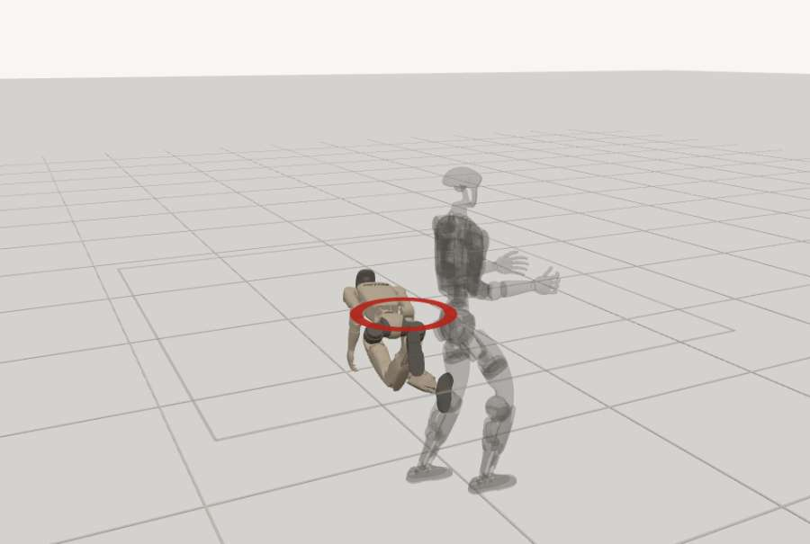
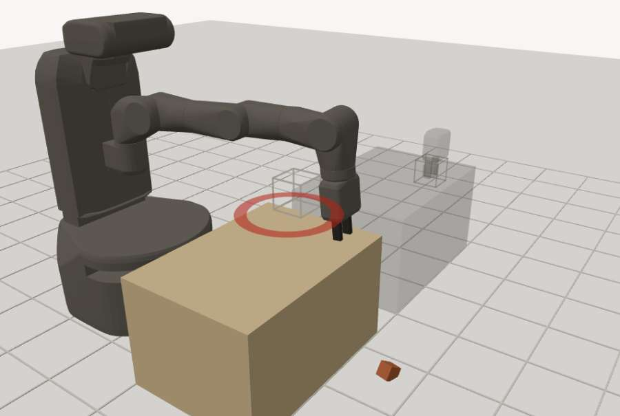
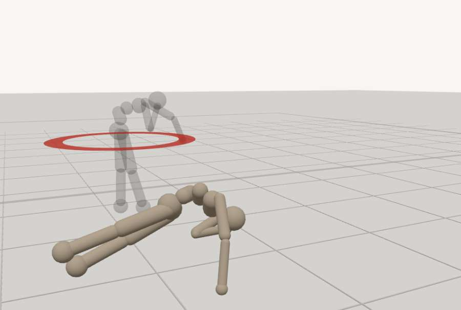
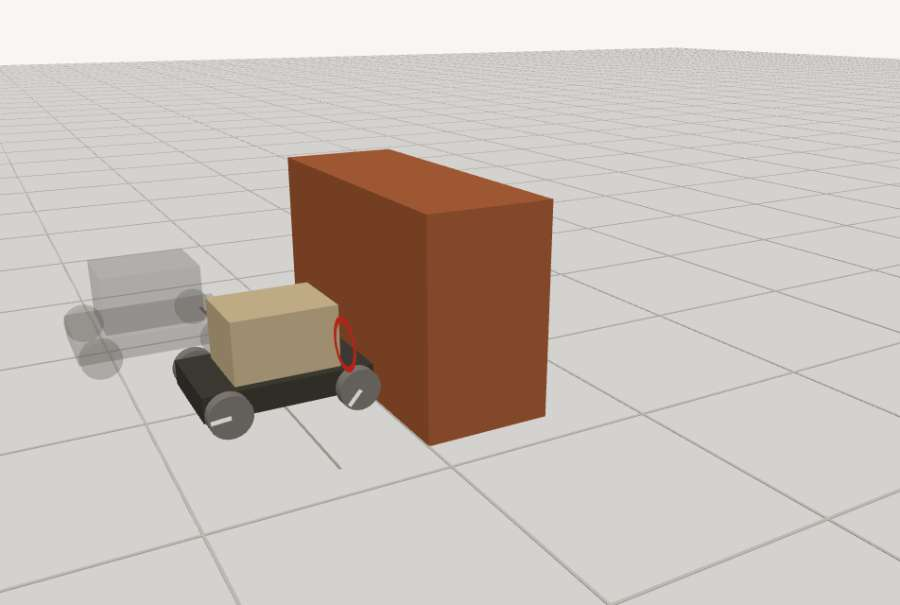
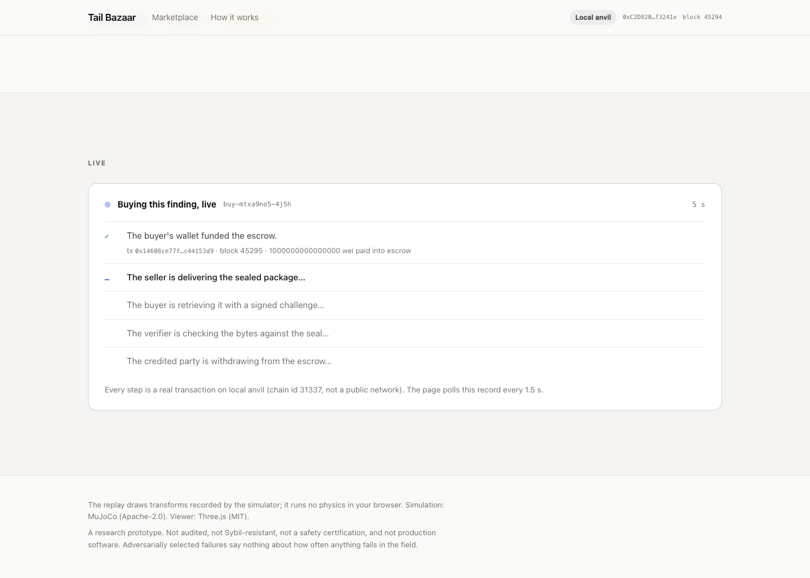

# Tail Bazaar

**A marketplace for reproducible robot failures.** Hunter agents search a robot's published operating envelope for the exact conditions under which its controller fails. Buyers pay into an escrow before they are allowed to look. A verifier re-runs the physics, and money moves only when the delivered evidence hashes to the sealed commitment.

**Live:** https://tailbazaar.duckdns.org · **Contract:** `FailureEscrow` at [`0xfadf11662C46c0214B0A40938a26FB8f0CD785A3`](https://sepolia.basescan.org/address/0xfadf11662C46c0214B0A40938a26FB8f0CD785A3) on Base Sepolia (chain id 84532), source verified · **Full write-up:** [docs/README-full.md](docs/README-full.md) · **Demo script:** [DEMO_SCRIPT.md](DEMO_SCRIPT.md)

| Unitree G1, 28 N·s shove from the side | Fetch arm, the part let go |
|---|---|
|  |  |
| **Gymnasium humanoid, torso on the floor** | **Warehouse cart, collision at 0.38 m/s** |
|  |  |

Every frame above is a recorded simulator trajectory drawn in the browser. No physics runs in the page; the grey ghost is the same policy at nominal conditions.

## The four answers

**Vertical.** Robot-controller testing. Sellers are hunter agents; buyers are the people who ship or insure a controller. The good is a failure scenario the buyer cannot inspect before paying, because inspecting it *is* having it.

**Trust assumptions.** One verifier, trusted for the verdict and constrained by the contract: only it can register a listing or settle, it can never take funds, it settles once, and every check it ran is published after settlement. The simulator is the ground truth, pinned by an environment fingerprint; a re-run that does not match is INCONCLUSIVE, never VALID. Sellers and buyers are untrusted: sealed commitments, re-simulation, a physical-plausibility bound on delivered frames, wallet-signed single-use retrieval challenges.

**Biggest design decision.** Listings are registered on chain only by the verifier, after it has re-simulated the scenario itself and computed the commitment. A listing's existence *is* the verifier's statement that the failure reproduces.

**One important limitation.** Adversarially selected failures are not failure frequencies. The hunters are built to find failures, so nothing here says how often anything fails in the field, and the simulations are uncalibrated research models. The contract is unaudited.

## Four robots

| Robot | Policy | Who defines "it failed" | Boundary the hunter found |
|---|---|---|---|
| Warehouse cart | fixed, documented brake controller | the simulator's own contact flag | 200 ms sensing delay on a 0.3-friction floor: collision at 0.38 m/s |
| Gymnasium humanoid | pretrained SAC expert (farama-minari) | Gymnasium's own health predicate | one 8 N·s shove, down in 0.9 s |
| Fetch pick-and-place | pretrained SAC+HER (IntelliGrow) | *not placed*: the environment's flag; *dropped*: our predicate, stated on the card | grip friction and latency: the part leaves the gripper at 3.2 m/s |
| Unitree G1 | Unitree's own pretrained walking policy, own MuJoCo model, own meshes | our predicate, stated on the card (pelvis below 0.46 m or tilt past 60°) | survives every shove ≤ 24 N·s; 28 N·s from the side or 80 ms latency fells it |

## How a trade works

1. **Hunt.** The seller's hunter runs a bounded search over the published envelope with that robot's own simulator.
2. **Verify and list.** The verifier re-runs the scenario, requires the identical trajectory hash and environment fingerprint, and registers the listing on chain with a commitment (keccak256 of the sealed package plus a salt) and a terms hash of the public summary.
3. **Buy.** The buyer checks the terms hash, seller, price and commitment against the chain, then funds the exact price in native ETH.
4. **Deliver.** The seller marks delivery with the hash of the bytes it sent.
5. **Retrieve.** The buyer fetches the package with a wallet-signed, single-use, expiring challenge bound to the order, its address, the chain and the domain; the server checks ownership on chain first.
6. **Settle.** The verifier checks the bytes against the seal and the whole run record against its own re-run, then settles once: valid credits the seller, invalid credits the buyer. Payouts are pull payments.
7. **Timeouts.** One hour to deliver, two to settle; after that anyone can trigger the buyer's refund.

Every unsold finding has a **Buy** button and every robot a **List a new finding** button. Both run the real agents against the chain while you watch, one transaction at a time.



## What the verifier checks

Environment fingerprint equal to its own; trajectory hash identical to its re-run; hash recomputed from the delivered frames, never trusted; frames physically possible for that scene; the run record (scene, events, metrics, ticks, claim) byte-identical to the re-run; severity band derived from its own measurement; not a near-duplicate of a listed finding. At delivery: bytes hash to the on-chain commitment. Reverted transactions throw before any state changes.

## Numbers

Tests: 22 contract (Foundry), 120 application, 13 integration against a local chain. Settled on Base Sepolia: 17 orders across four robots, valid and refunded. Cross-platform finding: the same scenario gives identical outcomes but different trajectory hashes on macOS and Linux, which is why the verifier certifies only within its own fingerprint.

## Run it locally

```bash
scripts/anvil-start.sh && scripts/local-deploy.sh      # local chain and escrow
(cd web && npm ci && npm run build && npm run demo -- --reset)   # hunt, verify, list, buy, settle, four robots
scripts/server-start.sh                                 # http://127.0.0.1:3100
```

Requires Node 22+, Foundry, and `uv` for the simulator (`cd sim && uv sync`). The repository `.env` holds test-only keys; see `.env.example`.

## Repository map

`contracts/` the escrow and its tests · `web/` server, agents, client · `sim/` MuJoCo targets, hunters, envelopes · `evidence/` runs, receipts, captures per target · `docs/README-full.md` the complete write-up · `REPORT.md` the review rounds · `LICENSE` MIT, third-party notices in `ATTRIBUTION.md` and beside each mesh set.

*A research prototype. Not audited, not Sybil-resistant, not a safety certification.*
