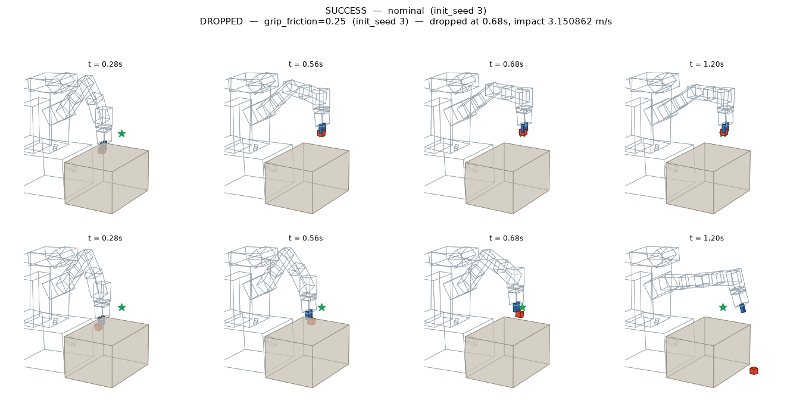
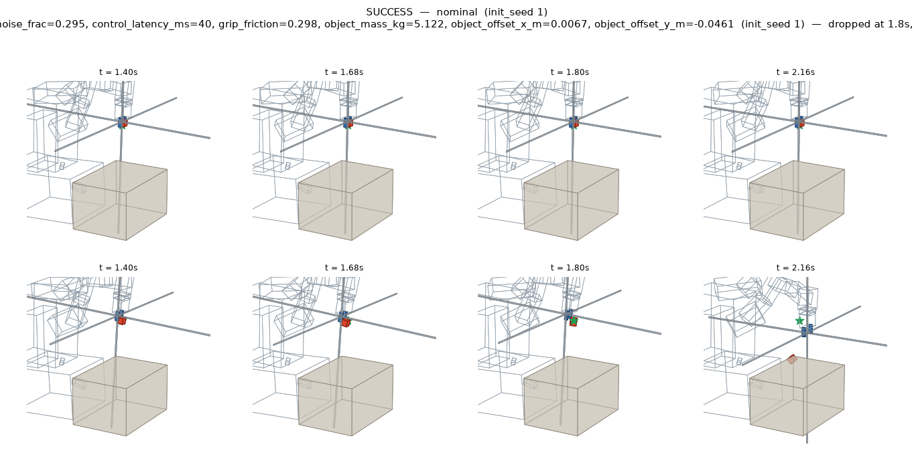

# Target #3 — a manipulator pick-and-place policy that can be made to drop the part

`target_id: arm-pick-place-sac-v1` · `envelope_id: tb-arm-envelope-1` · `schema: tb-arm-run-1`

Everything in this directory was produced by `sim/tailbazaar_sim/arm/`. It is **additive**: the
cart target (`tb-envelope-1`, `tb-run-2`) and the humanoid target (`tb-humanoid-envelope-1`,
`tb-humanoid-run-1`) are untouched and keep working exactly as they did. Every number below is a
measurement from the files in this directory, not a target.

---

## 1. What the target is

A **pretrained** pick-and-place policy that somebody else trained and published. Nothing in this
project trains, fine-tunes or scripts anything: the policy is treated the way the cart target
treats `controller.py` — a fixed artefact pinned by hash, never edited, whose operating range is
the product question.

| | |
|---|---|
| Hugging Face repo | [`IntelliGrow/FetchPickAndPlace-v4`](https://huggingface.co/IntelliGrow/FetchPickAndPlace-v4/tree/04bb1bf735f6a2957d8b77d185afe46ba112357a) |
| Pinned revision | `04bb1bf735f6a2957d8b77d185afe46ba112357a` (a commit, not `main`) |
| File | `sac-FetchPickAndPlace-v4.zip`, 3 374 885 bytes |
| Archive sha256 | `2b1b30dd5e778a1f04868891eaa447ad7387f79d1f4db3514e01b9b189be1481` |
| Weights inside it | `policy.pth`, 1 520 771 bytes, sha256 `792506461c719beb3926cb4230b258bdcf47ed8efbbc3eca8b31539e4fd710ea` |
| Actor-tensor digest | `sha256:09a0e01d754d5ec5ea8b5ecb762e4e5cd8c1505cf63bb013517573328590feaa` — over exactly the six tensors used for control |
| Algorithm | SAC + Hindsight Experience Replay, `MultiInputPolicy`, Stable-Baselines3 2.7.0 |
| Network | MLP 31 → 256 → 256 → 4, ReLU, tanh-squashed, deterministic mean action, 75 012 parameters |
| Publisher's claim | `mean_reward -9.70 ± 4.17` over 10 deterministic episodes (`results.json` on the repo) |
| Environment | Gymnasium-Robotics `FetchPickAndPlace-v4`, unmodified `fetch/pick_and_place.xml` |

All four digests are **checked at load time**, not merely recorded, along with the actor's shape:
`policy.py` refuses to run if the archive, the weights or the layer widths differ from the pins.

The sparse reward is −1 per control step at which the block is not within 5 cm of the goal, over
50 steps. So the publisher's −9.70 means the block reaches the goal after about ten steps and
stays there, and a single failed episode would have scored −50 and blown the quoted spread apart.

### Why this checkpoint and not an rl-zoo3 one

The brief preferred an rl-zoo3/sb3 checkpoint. `sb3/tqc-FetchPickAndPlace-v1` was loaded and
measured here too, and **it places the block 20/20 over seeds 0–19** — as does
`hhmm1122/fetch-pickandplace-sac-her`. Both were rejected as the primary target for stated
reasons, not because they failed:

| candidate | licence | measured here | why not primary |
|---|---|---|---|
| `sb3/tqc-FetchPickAndPlace-v1` (TQC+HER, rl-zoo3, `[512,512,512]`) | none declared | **20/20** | trained on `FetchPickAndPlace-v1`, the mujoco-py environment that no longer exists, and behind `sb3_contrib`'s `TimeFeatureWrapper`. Running it needs an environment-version transplant *and* a wrapper reimplementation, and its published number was measured on an environment that cannot be run here — so it cannot serve as a check on this harness. |
| `hhmm1122/fetch-pickandplace-sac-her` (SAC+HER, `[512,512,512]`) | none declared | **20/20** | right environment version, but publishes only `best_model.zip` with no config and no eval protocol: less to pin, nothing to reproduce. |
| `crislmfroes/tqc-FetchPickAndPlace-v2` | none declared | not run | published `mean_reward -12.70 ± 12.81`; that spread implies failed episodes at nominal. |

The chosen checkpoint was trained and published on the **exact environment version that runs
here**, which is what makes the publisher's own number a usable gate on the numpy reimplementation
(§4). That two independent checkpoints from different authors and different algorithms both place
20/20 in this harness is also the strongest available evidence that the harness itself is right.

### Licence — the same constraint the humanoid target hit

**The model repository declares no licence.** No `license:` field in its card metadata, no
`license:*` tag, no `LICENSE` file. **Neither does any other FetchPickAndPlace checkpoint on the
hub.** Six were checked one by one — `IntelliGrow/FetchPickAndPlace-v4`,
`sb3/tqc-FetchPickAndPlace-v1`, `hhmm1122/fetch-pickandplace-sac-her`,
`crislmfroes/tqc-FetchPickAndPlace-v2`, `Edgar404/td3-FetchPickAndPlaceDense-v2-v3`,
`qgallouedec/tqc-FetchPickAndPlace-v1-3795610126` — and all six declare nothing. There was no
licensed alternative to switch to.

What this project does instead of asserting a licence it does not have:

- the weights are **downloaded at run time**, never vendored into this repository, never modified
  and never redistributed — only their sha256 digests and the measured behaviour are published;
- the publisher is named and linked everywhere the policy appears (`policy.py`, the run documents,
  the envelope YAML, here);
- `policy.py::LICENCE_NOTE` records exactly what was checked and states `declared_spdx: null`.

**Anyone redistributing these weights should resolve the licence with the publisher first.**

The **scene** is a different matter and is properly licensed: Gymnasium-Robotics is **MIT**
(Farama Foundation), and the Fetch MJCF it ships carries that licence.

### How the policy is evaluated (and why there is no torch dependency)

Stable-Baselines3 stores the actor as a plain torch `state_dict`. Depending on torch and SB3 at
run time would add roughly 2 GB of wheels for a 75 012-parameter MLP. Instead `policy.py` reads
the `.pth` container directly with the **restricted unpickler already written for the humanoid
target** — imported, not copied, so a security-sensitive unpickler has exactly one implementation
in this repository — and evaluates the actor in numpy. The arithmetic is exactly SB3's
`SACPolicy.predict(deterministic=True)` for a `MultiInputPolicy` whose feature extractor is the
parameter-free `CombinedExtractor`.

The observation key order is not a guess: `CombinedExtractor` iterates
`observation_space.spaces.items()`, and Gymnasium's `Dict` stores its subspaces sorted by key, so
the concatenation is `achieved_goal` (3) + `desired_goal` (3) + `observation` (25) = **31**, which
is exactly the first layer's input width. `load_policy` refuses to run if it is not.

---

## 2. One compatibility shim, and why it exists

**Gymnasium-Robotics 1.4.2 cannot build a Fetch environment on MuJoCo 3.13.0 at all.** Four sites
in `gymnasium_robotics/utils/mujoco_utils.py` guard their joint-slot arithmetic with

```python
assert joint_type in (mujoco.mjtJoint.mjJNT_HINGE, mujoco.mjtJoint.mjJNT_SLIDE)
```

`joint_type` is a **numpy int32** from `model.jnt_type`; the tuple holds **pybind11 enum**
members. On this pin the containment test is false where the corresponding equality is true:

```
np.int32(2) == mujoco.mjtJoint.mjJNT_SLIDE   ->  True
np.int32(2) in (mjJNT_HINGE, mjJNT_SLIDE)    ->  False      # the bug
2           in (mjJNT_HINGE, mjJNT_SLIDE)    ->  True
```

`gym.make("FetchPickAndPlace-v4")` raises `AssertionError` from inside the constructor, before a
single step. This is an incompatibility between two pinned third-party versions. Pinning MuJoCo
down to a version Gymnasium-Robotics was tested against would move the engine pin that the cart
and humanoid targets have already published evidence against, so that option does not exist.

`arm/compat.py` rebinds the **module-global name `mujoco`** inside `mujoco_utils` to a proxy that
forwards every attribute to the real module except `mjtJoint`, whose four members are plain ints.
**It reproduces no upstream logic**: no function body is copied, no branch is changed, no numeric
behaviour is touched — the same `ndim` is selected and the same qpos slots are written. That is
why it was done this way rather than by vendoring corrected copies of four functions, which could
silently drift from the version actually installed. The shim refuses to apply to any
Gymnasium-Robotics version other than the one it was verified against.

`compat.verify()` **proves** this rather than asserting it, and `arm.cli selfcheck` runs it: it
writes known values into a slide joint and a free joint through the patched accessors and compares
against `data.qpos` read directly. All **7 checks pass**, and `bug_present_without_shim: true` is
recorded, so a future version that fixes the problem or changes these functions' meaning fails
loudly. Every run document carries the shim's `scene.compat_shim` block.

---

## 3. The scene and the operating envelope

The scene is Gymnasium-Robotics' shipped `fetch/pick_and_place.xml`
(`sha256:019af84a6ee8e0ce5…`), compiled unmodified. A Fetch arm, a table whose top sits at
z = 0.400 m, a 5 cm cube resting on it at z = 0.425 m, and a goal the environment samples itself —
in the air about half the time. Only three model fields are ever written, and all three are
declared envelope axes. The compiled model's parameters are hashed into every run document
(`scene.compiled_model_hash`), so a replay can prove it ran against the same physics.

Machine-readable envelope: [`sim/envelope-arm.yaml`](../../sim/envelope-arm.yaml), in the same
GUARD-shaped `name / low / high / nominal / marginal / scale / units / group` form the cart and the
humanoid use. `sim/tailbazaar_sim/arm/envelope.py` is authoritative and `arm.cli selfcheck` fails
if the two drift apart.

| axis | group | range | nominal | units | published conditions |
|---|---|---|---|---|---|
| `object_mass_kg` | physical | 0.2 – 20.0 | 2.0 | kg | = 2.0 |
| `grip_friction` | physical | 0.02 – 1.5 | 1.0 | coefficient | = 1.0 |
| `object_offset_x_m` | physical | −0.05 – 0.05 | 0 | m | = 0 |
| `object_offset_y_m` | physical | −0.05 – 0.05 | 0 | m | = 0 |
| `action_noise_frac` | systems | 0 – 0.5 | 0 | — | = 0 |
| `control_latency_ms` | systems | 0 – 160, ×40 ms | 0 | ms | = 0 |
| `gripper_latency_ms` | systems | 0 – 160, ×40 ms | 0 | ms | = 0 |
| `init_seed` | physical (discrete) | {0…7} | 0 | — | not stated |

**These bounds are illustrative assumptions for a demonstration, not measurements of a real
robot.** The reasoning behind each is in the YAML and in `envelope.py`. Two are worth restating:

- **`object_mass_kg` is a payload axis, not a material.** The shipped block is a 5 cm cube at
  2.0 kg — a density of 16 000 kg/m³, denser than lead. The stock object is not realistic either,
  so the axis is honest only as "how heavy a payload", and the 20 kg bound is deliberately past
  the interesting region rather than hiding it.
- **`grip_friction` is written on the block *and both finger pads*.** MuJoCo combines a contact
  pair's friction with the maximum of the two geoms, so lowering only the block would change
  nothing at all while the pads still carried 1.0 — the same trap the humanoid target documents
  for its floor. The stock model ships 1.0 on all three, so writing one value on all three
  reproduces the stock scene exactly at nominal.

`init_seed` is a **stratification**, not a coordinate: `reset(seed=s)` makes the environment sample
a different block position *and* a different goal, so each seed is a different pick-and-place
problem, two runs from different seeds are never duplicates, and a finding's distance to nominal is
measured within its own stratum.

### Who owns which predicate

| | owner |
|---|---|
| `SUCCESS` / `NOT_PLACED` | **the environment.** `info["is_success"]` from `env.step`, i.e. `FetchEnv._is_success`, which is `goal_distance < distance_threshold` with the environment's own 5 cm threshold. This project implements no placement detector. |
| `DROPPED` | **this project**, because the environment cannot provide it: the environment scores *placement*, not *custody*. |
| episode horizon | **the environment.** 50 control ticks, read from `gym.spec("FetchPickAndPlace-v4").max_episode_steps`. |

The success flag is cross-checked at every tick against the distance recomputed from the
environment's own `achieved_goal` and `desired_goal`, and the mismatch count is published in every
run and every hunt document. **Across all 325 simulations in this directory the total is 0.**

### The drop predicate, and the artefact it had to be hardened against

A release is **proposed** at control tick *k* when the block was in contact with **both** finger
pads at *k−1*, its centre was more than `airborne_margin_m` = 0.03 m above its resting height, at
*k* MuJoCo reports fewer than both pads in contact, and `info["is_success"]` is false.

It is **confirmed** as a drop only if, over the next **3 ticks (120 ms)**, the grasp is not
regained *and* the block is at some point in contact with nothing at all.

That confirmation is not cosmetic. The first grid sweep produced a "drop" in which the block was
rising steadily — 0.507 → 0.601 → 0.632 m at a constant 0.67 m/s — with a single 40 ms tick of
one pad's contact missing from MuJoCo's list while the block was still firmly pinched. Without the
confirmation window that artefact would have been sold as a dropped part. With it, `grid-grip`
went from 7 "drops" to **4 real ones**. Discarded proposals are recorded as `RELEASE_DISCARDED`
events in the run document, so the evidence shows what was considered and rejected, not only what
survived.

After the predicate fires, simulation continues past the environment's horizon — the policy still
acting, nothing frozen or scripted — until the block has landed, capped at 30 ticks (1.2 s), so
the impact can be measured and the replay shows the fall. **A drop is never *proposed* in the
settle window**; only its confirmation may extend a few ticks past the horizon.

Outcomes: `SUCCESS` / `DROPPED` / `NOT_PLACED` are conclusive; `DIVERGED`,
`INVALID_INITIAL_STATE` and `REJECTED_OUT_OF_ENVELOPE` are inconclusive and never pay. **Zero
inconclusive runs occurred in any hunt.** A run that dropped the block and then recovered and
placed it anyway is still a `DROPPED` — the question is literally whether the arm drops things —
but carries `recovered_after_drop: true` and the environment's own success flag beside it.

**Severity proxies, both directly measured, neither a damage or injury estimate:**

- `object_impact_speed_mps` — the block's world-frame linear speed (its free joint's linear dof
  velocity, exact for a free body) at the **last control tick at which it was still unsupported**,
  i.e. immediately before its first contact with the table or the floor. Speed is sampled at the
  40 ms control tick, so a free fall gains about 0.39 m/s between samples; the reported value is
  the last sample before contact, **never an extrapolation**.
- `drop_height_m` — block centre height at the drop minus its height at that first contact.

`NOT_PLACED` has **no severity proxy**, deliberately: nothing was dropped and nothing hit anything,
so there is no measured quantity to report. An invented stand-in would look like a severity and
would not be one.

No monetary value, damage estimate or biomechanical tier is attached anywhere.

---

## 4. Nominal suite — actual results

[`nominal-suite.json`](nominal-suite.json) · 8 cases, written before they were run and not tuned
against their own results.

| case | outcome | return | block lift | closest approach to goal | dropped |
|---|---|---|---|---|---|
| published-conditions-seed-0 | SUCCESS | −12 | 0.013 m | 0.0019 m | no |
| published-conditions-seed-1 | SUCCESS | −16 | 0.385 m | 0.0236 m | no |
| published-conditions-seed-2 | SUCCESS | −8 | 0.120 m | 0.0174 m | no |
| published-conditions-seed-3 | SUCCESS | −12 | 0.226 m | 0.0062 m | no |
| lighter-part (1 kg) | SUCCESS | −12 | 0.010 m | 0.0032 m | no |
| slightly-slicker-grip (μ 0.7) | SUCCESS | −16 | 0.377 m | 0.0164 m | no |
| part-1cm-off | SUCCESS | −9 | 0.129 m | 0.0173 m | no |
| a-little-actuation-noise (5 %) | SUCCESS | −18 | 0.222 m | 0.0191 m | no |

**`all_passed: true`, `no_case_dropped: true`, `success_predicate_mismatches: 0`.**

**The harness reproduces the published target.** Measured mean return over the four
published-conditions episodes is **−12.00** against the publisher's claimed **−9.70 ± 4.17** —
inside the publisher's own quoted spread. That is the gate: if the numpy actor, the observation key
order, the compatibility shim or the scene mutations were wrong, this number would not land there.

Unlike the humanoid target, **the benign block passes too**: none of the four small perturbations
breaks this policy. That is a real difference between the two targets and is reported as measured —
this policy is genuinely robust to the mild end of every axis, which is what makes the boundary
worth locating.

---

## 5. Bounded hunter — actual results

Every mode builds its full scenario list **before** the first run. Nothing adapts, nothing learns,
there is no model in the loop, and there is no LLM call anywhere in this package.

| hunt | simulations | sim steps | wall | success | dropped | not placed | inconclusive | distinct findings | near-duplicates |
|---|---|---|---|---|---|---|---|---|---|
| [`grid-grip`](hunt-grid-grip.json) — friction × seed | 72 | 72 000 | 2.21 s | 64 | **4** (2 to the floor) | 4 | 0 | 8 | 0 |
| [`grid-payload`](hunt-grid-payload.json) — mass × seed | 48 | 48 000 | 1.46 s | 48 | **0** | 0 | 0 | 0 | 0 |
| [`grid-placement`](hunt-grid-placement.json) — offset x × y | 25 | 25 000 | 0.86 s | 25 | **0** | 0 | 0 | 0 | 0 |
| [`grid-systems`](hunt-grid-systems.json) — latency × noise | 30 | 30 000 | 0.90 s | 15 | **0** | 15 | 0 | 15 | 0 |
| [`random`](hunt-random-seed7.json) — all 7 axes + 8 seeds, seed 7 | 150 | 150 320 | 3.94 s | 30 | **16** (2 recovered, 1 to the floor) | 104 | 0 | 120 | 0 |

**325 simulations, 325 320 physics steps, 9.37 s of wall time** on one thread of an Apple M-series
CPU. 20 drops, 0 inconclusive, 0 predicate mismatches.

### What the searches actually mapped

**Grip friction × initial state** (`.` placed, `x` not placed, **`D`** dropped):

| μ | s0 | s1 | s2 | s3 | s4 | s5 | s6 | s7 |
|---|---|---|---|---|---|---|---|---|
| **1.0** | . | . | . | . | . | . | . | . |
| **0.7** | . | . | . | x | . | . | . | . |
| **0.5** | . | . | . | . | . | . | . | . |
| **0.35** | . | . | . | . | . | . | . | . |
| **0.25** | . | . | . | **D** | . | . | . | . |
| **0.15** | . | . | . | . | . | . | . | . |
| **0.1** | . | . | x | x | . | . | . | . |
| **0.05** | . | . | . | **D** | . | . | . | . |
| **0.02** | . | **D** | . | x | **D** | . | . | . |

The honest reading: **failure is not monotone in friction, and it is concentrated in the
geometry.** Five of the eight pick-and-place problems place the block at every friction down to
0.02 — fifty times slipperier than the policy ever saw. Seed 3 fails at five of the nine values
and seed 2 at one. The boundary is a property of *this block position and this goal*, not a
friction threshold that can be quoted for the policy as a whole. A single number would have been a
more sellable answer and a false one.

**Block mass × initial state: 48 of 48 placed.** A heavier part on its own — up to **20 kg, ten
times the published mass** — never costs the grasp, at any of the eight geometries. This axis was
deliberately re-cut from an earlier mass × friction grid so that the answer would not be
confounded; the interaction is covered by the random mode below.

**Block offset × offset: 25 of 25 placed.** Moving the part up to ±5 cm — one full block width, a
third of the environment's own sampling range — never costs the grasp or the placement. The policy
observes the block's pose, so it simply goes where the block is.

**Latency × action noise, seed 0:**

| latency | noise 0 | 0.1 | 0.2 | 0.3 | 0.4 | 0.5 |
|---|---|---|---|---|---|---|
| **0 ms** | . | . | . | . | . | . |
| **40 ms** | . | . | x | . | . | . |
| **80 ms** | x | . | . | x | x | . |
| **120 ms** | . | x | x | x | x | x |
| **160 ms** | x | x | x | x | x | x |

**Not one drop in the whole systems grid.** Noise alone, up to half the full command range, never
fails anything; latency at 120 ms and above fails to place almost everywhere. The systems axis
costs this policy the **placement**, not the **part** — the opposite shape from the humanoid
target, where one 15 ms tick of latency put it on the floor. Reported as measured.

**Random, 150 draws over all seven axes and all eight seeds.** 16 drops, 104 not placed, 30
placed. **15 of the 16 drops are at a block mass of 5 kg or more** (median 14.7 kg) even though
only 115 of 150 draws were that heavy, and only 6 of 16 are at μ ≤ 0.5. So mass, which does nothing
on its own, is the dominant driver **in combination** — a heavy part plus some slip plus some
noise. That is the finding a single-axis sweep could not have produced, and it is why the random
mode exists. Impact speeds ranged 0.23 – 2.83 m/s (median 1.80).

---

## 6. The selected finding

Selection rule, deterministic and published: group by failure-class set, then prefer the
**smallest** normalized L∞ distance to nominal within the finding's own initial-state stratum —
the mildest conditions that break the policy — ties broken by higher severity proxy, with
approximate duplicates (distance < 0.05) dropped.

**Mildest `DROPPED` across every hunt** — [`runs/finding-grip-025.json`](runs/finding-grip-025.json)

```json
{"object_mass_kg": 2.0, "grip_friction": 0.25, "object_offset_x_m": 0.0, "object_offset_y_m": 0.0,
 "action_noise_frac": 0.0, "control_latency_ms": 0, "gripper_latency_ms": 0, "init_seed": 3}
```

| | |
|---|---|
| outcome / class | `DROPPED` (both-pad contact lost while airborne, confirmed over 3 ticks) |
| distance to nominal | **0.5068** — only the friction axis moves, from 1.0 to 0.25 |
| predicate fired | **t = 0.680 s**, block 0.151 m above the table, moving at 0.958 m/s |
| confirmed at | t = 0.800 s (grasp not regained, block in free flight) |
| how close it got first | **0.0534 m** from the goal — a whisker outside the environment's own 0.05 m threshold |
| landed | t = 1.080 s on **`floor0`** — it went off the table onto the floor |
| **impact speed** | **3.151 m/s** |
| drop height | 0.456 m |
| return | −50 (against −12 for the same seed at nominal) |
| trajectory hash | `0xc34cf1174a11df86cff27328150c75a1fd6119976746678e5c43e1bb837a7373` |
| state hash | `sha256:a804b012e7b9a4c3efc23f7c8cec699bef33b7492b7c0a4b2c9fa12d5966ee1f` |

One axis moved, to a quarter of the shipped grip. The arm lifts the block, carries it to within
5.3 cm of the goal, and lets go 15 cm above the table; the block clears the table edge and hits the
floor at 3.15 m/s.

A second finding is kept because it is the multi-axis one the grids could not have produced —
[`runs/finding-combined-seed1.json`](runs/finding-combined-seed1.json): 5.12 kg block, μ 0.298,
block 4.6 cm off, 29.5 % action noise, one tick of latency, seed 1. The block is carried all the
way to **0.0548 m from the goal at 0.348 m above the table** and then released; impact 2.262 m/s
on the table top; distance to nominal 0.59.

### Repeatability — byte-identical

[`repeatability-ccc8470e.json`](repeatability-ccc8470e.json) (the grip finding) and
[`repeatability-04bb0375.json`](repeatability-04bb0375.json) (the combined finding). Each is three
in-process re-runs plus one **fresh subprocess**, comparing both hashes and nineteen metric fields.

**`identical: true` for both.** Two independent digests are checked: `trajectory_hash` (keccak-256
over the canonical JSON of the recorded replay frames, the same construction the cart and humanoid
use) and `state_hash` (sha256 over the raw float64 `qpos`/`qvel` bytes at **every** control tick,
unrounded — the stricter of the two).

As with the other two targets, this is repeatability **within this pinned environment** — MuJoCo
3.13.0, Gymnasium 1.3.0, Gymnasium-Robotics 1.4.2, numpy 2.5.3, Python 3.12.13, single thread,
`Darwin-arm64` — pinned in every document's `engine` block alongside the `uv.lock` digest. It is
not a claim about other machines or other engine versions.

---

## 7. Pictures

| | |
|---|---|
|  | `arm-side-by-side.png` — the same policy, the same seed, the same four instants. Top row nominal: the block (red) ends at the goal (green star). Bottom row at μ 0.25: the block is on the floor beside the table while the gripper sits empty at the goal. |
|  | `arm-combined-side-by-side.png` — the multi-axis finding on seed 1, around its own drop at 1.80 s. |

Animations: `baseline-seed3.gif` / `baseline-seed1.gif` (places it), `finding-grip-025.gif` and
`finding-combined-seed1.gif` (drops it). Metric plots `*-metrics.png` show the block's height
against the table and the airborne margin, with the both-pad grasp shaded, the drop marked in red
and the landing dotted, over the block-to-goal distance against the environment's own 5 cm
threshold.

Every picture is drawn **from the recorded transforms only** — no second physics run, no MuJoCo
renderer, no display. `render.py` is optional and lazily imported; the core path (`policy`,
`selfcheck`, `nominal`, `hunt`, `run`, `repeat`) needs only numpy, mujoco, gymnasium,
gymnasium-robotics and huggingface-hub, and runs headless on Linux x86-64 as well as macOS arm64.

---

## 8. What the UI needs (data-driven, no special-casing)

Every run document carries these as **explicit top-level fields**:

```
schema                "tb-arm-run-1"
target_id             "arm-pick-place-sac-v1"
target_kind           "pretrained_policy"
target_label          "Fetch pick-and-place policy (SAC+HER, Gymnasium-Robotics FetchPickAndPlace-v4)"
envelope_id           "tb-arm-envelope-1"
outcome               "SUCCESS" | "DROPPED" | "NOT_PLACED" | "DIVERGED" | "INVALID_INITIAL_STATE" | "REJECTED_OUT_OF_ENVELOPE"
failure_classes       ["DROPPED"]     (empty when nothing failed)
primary_failure_class "DROPPED" | "NOT_PLACED" | "NONE"
conclusive            true | false
failure_event         {class, t_s, object_z_m, height_above_table_m, object_goal_distance_m,
                       landed_t_s, landed_on_geom, landed_on_the_floor, recovered_after_drop, …} | null
severity              {proxy, value, units, secondary_proxy, secondary_value, …} | null
goal_m                [x, y, z]      where the target sits, fixed for the episode
```

Replay needs no physics and no hard-coded geometry:

```
frames.bodies[i]            the i-th body's name
frames.data[k]              [t, (x, y, z, qw, qx, qy, qz) × len(bodies)]   world pose per body
frames.dt_s / source_dt_s / stride / places     the decimation, declared rather than guessed
scene.render_bodies[j]      {body, geom, type, role, pos_m, quat_wxyz, size, rgba}
                            one primitive, posed LOCAL to its body
```

Composing those two gives the world pose of every primitive. `render.py` is the reference consumer
and hard-codes nothing about the Fetch arm, which is the proof the contract is sufficient.

Two fields exist because drawing this scene from data needs them, and both are classified from the
compiled model rather than by name:

- **`role`** — `"collision"` or `"visual_marker"`, from `contype`/`conaffinity`. The Fetch scene
  carries MuJoCo's mocap gizmo: three **2 m long** thin bars on `robot0:mocap` marking the weld
  target the environment drives the gripper with. A viewer that drew them would put a giant
  coordinate cross through every frame. They collide with nothing, so the contract says so and
  every consumer skips them.
- **`box_half_extent_m` + `proxy`** — the arm's links are **meshes**, which a from-data viewer
  cannot tessellate. Each mesh geom publishes MuJoCo's own bounding half-extents and says plainly
  that a box is a proxy, not the shape. Everything the failure story is about — the block, the
  gripper pads, the table, the floor — is a real box or plane and is exact.

**Frame payload.** Control runs at 25 Hz and an episode is 50 ticks, so frames are recorded at the
control rate with **no decimation** (`stride: 1`) — decimating a 25 Hz signal for a viewer would
only make the replay worse — and coordinates are rounded to 4 decimals (0.1 mm on positions, about
0.01° on unit quaternions). Result: **71 KB for a 51-frame placement, 73 KB for the 51-frame drop**,
20 bodies and 24 primitives. The `state_hash` is computed on the **unrounded** state, so the
rounding never weakens the repeatability check.

---

## 9. Reproducing all of this

```bash
cd sim
uv run python -m tailbazaar_sim.arm.cli policy        # pinned provenance, verified digests
uv run python -m tailbazaar_sim.arm.cli selfcheck     # shim proof + YAML/Python drift + rule checks
uv run python -m tailbazaar_sim.arm.cli nominal
uv run python -m tailbazaar_sim.arm.cli hunt --mode grid-grip      --quiet
uv run python -m tailbazaar_sim.arm.cli hunt --mode grid-payload   --quiet
uv run python -m tailbazaar_sim.arm.cli hunt --mode grid-systems   --quiet
uv run python -m tailbazaar_sim.arm.cli hunt --mode grid-placement --quiet
uv run python -m tailbazaar_sim.arm.cli hunt --mode random --n 150 --seed 7 --quiet
uv run python -m tailbazaar_sim.arm.cli run  --name baseline-seed3 --scenario '{"init_seed":3}'
uv run python -m tailbazaar_sim.arm.cli run  --name finding-grip-025 \
    --scenario '{"grip_friction":0.25,"init_seed":3}'
uv run python -m tailbazaar_sim.arm.cli repeat --n 3 \
    --scenario '{"grip_friction":0.25,"init_seed":3}'
# pictures (optional; needs matplotlib + Pillow, still headless)
uv run python -m tailbazaar_sim.arm.cli compare --name arm-side-by-side \
    --baseline out-arm/runs/baseline-seed3.json --failure out-arm/runs/finding-grip-025.json
```

The first command downloads 3.4 MB from Hugging Face into `sim/.cache/` (git-ignored). On a machine
with no network, pre-fetch the archive and point `TAILBAZAAR_ARM_ARCHIVE` at it; the sha256 check
applies either way, so an offline copy cannot quietly be a different file.

---

## 10. Limits of what is claimed

- **This is a simulated arm, not a robot.** The Fetch model is driven by a **mocap weld** on the
  end-effector, not by joint torques — the policy commands a Cartesian displacement of the gripper
  and a gripper opening, and MuJoCo drags the arm there. There is no perception stack, no
  compliance, no real actuator model, and no force control. Nothing here transfers to hardware.
- **The part is not a realistic part.** A 5 cm cube at 2 kg is denser than lead before the mass
  axis is touched at all. See §3.
- **No probability is estimated.** The hunter runs bounded deterministic searches and reports
  individual reproducible failures. Adversarially selected failures are not failure frequencies,
  and no distribution `D` is stated (`marginal` and `scale` are null throughout, as in the cart and
  humanoid envelopes).
- **The envelope bounds are illustrative assumptions**, chosen and justified in the YAML, not
  measured.
- **A finding outside the published conditions is not a defect report.** The publisher evaluated
  unmodified `FetchPickAndPlace-v4` and claims nothing about payload mass, grip friction, block
  placement, noise or latency. Every run document carries `published_conditions.per_axis_inside` so
  a reader can see immediately which axes a finding left, with `null` where the publisher states
  nothing rather than an invented bound.
- **The drop predicate is this project's, not the environment's.** It is mechanical, it reads
  MuJoCo's own contact list, and the confirmation window and its motivation are documented above —
  but it is a definition this project chose, and §3 says exactly what it is so a reader can
  disagree with it on the evidence rather than on trust.
- **Repeatability is within this pinned environment only.** See §6.
- **The severity proxies are kinematics.** An impact speed in m/s is not damage, breakage or cost,
  and nothing in this package converts it into any of those.
- **The policy's licence is undeclared**, and so is every alternative's. See §1.
