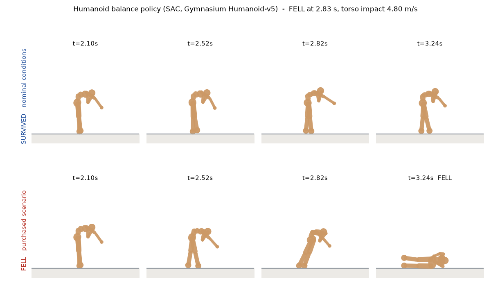
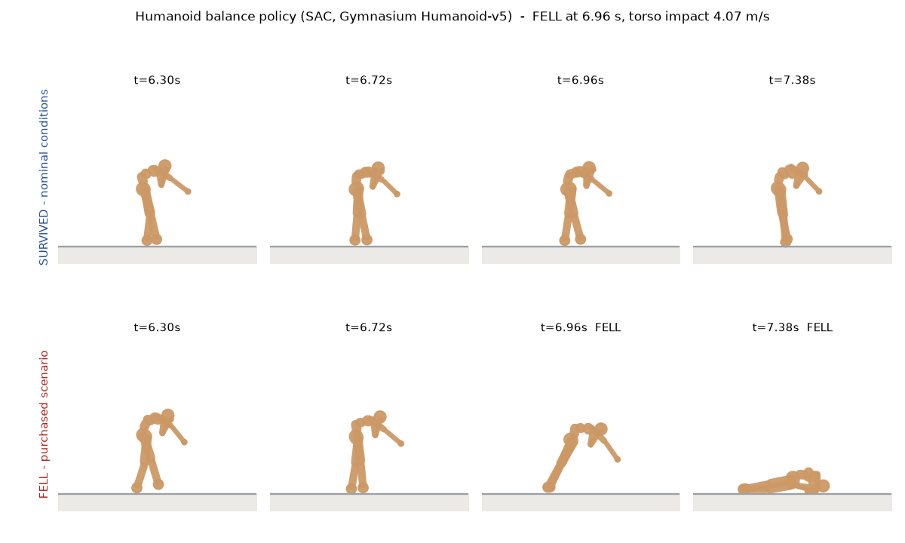

# Target #2 — a humanoid balance policy that can be pushed over

`target_id: humanoid-balance-sac-v1` · `envelope_id: tb-humanoid-envelope-1` · `schema: tb-humanoid-run-1`

Everything in this directory was produced by `sim/tailbazaar_sim/humanoid/`. It is **additive**: the
cart target (`tb-envelope-1`, `tb-run-2`) and its evidence are untouched and keep working exactly as
they did. Every number below is a measurement from the files in this directory, not a target.

---

## 1. What the target is

A **pretrained** humanoid locomotion/balance policy that somebody else trained and published. Nothing
in this project trains, fine-tunes or scripts anything: the policy is treated the way the cart target
treats `controller.py` — a fixed artefact pinned by hash, never edited, whose operating range is the
product question.

| | |
|---|---|
| Hugging Face repo | [`farama-minari/Humanoid-v5-SAC-expert`](https://huggingface.co/farama-minari/Humanoid-v5-SAC-expert/tree/f9130b25c70584670ceac33eb1d06fbc418d691a) |
| Pinned revision | `f9130b25c70584670ceac33eb1d06fbc418d691a` (a commit, not `main`) |
| File | `humanoid-v5-sac-expert.zip`, 7 179 847 bytes |
| Archive sha256 | `5a7b38be61afb41cfe37acdc70e9997f29415a833684d91773c6049951a18cd6` |
| Weights inside it | `policy.pth`, 3 222 902 bytes, sha256 `6437d3dd02bc2fc92f5f2bcbf5d48eac0e5db209d4aae3bb7d039f14df3e18ef` |
| Actor-tensor digest | `1a1eb40969a86e533ad8b9e62ef7f8e361d69063ac23eda495de2dfda18fe311` (sha256 over exactly the six tensors used for control) |
| Algorithm | SAC, Stable-Baselines3 2.4.0a10, trained 1e8 steps |
| Network | MLP 348 → 256 → 256 → 17, ReLU, tanh-squashed, deterministic mean action |
| Publisher's claim | `mean_reward 8127.00 ± 46.46` over 10 deterministic episodes (`results.json` on the repo) |
| Environment | Gymnasium `Humanoid-v5`, unmodified `humanoid.xml`, 42.116 kg, 17 actuators |

All four digests are **checked at load time**, not merely recorded: `policy.py` refuses to run if the
archive, the weights or the tensor shapes differ from the pins above.

### Licence — the one constraint this work could not fully satisfy

**The model repository declares no licence.** There is no `license:` field in its card metadata, no
`license:*` tag, and no `LICENSE` file. The brief said to pick another candidate if a licence is
unclear, and that was attempted:

| Candidate | Licence | Why not |
|---|---|---|
| `sb3/sac-Humanoid-v3` (RL Baselines3 Zoo, mean_reward 6251.93) | none declared | same problem |
| `cleanrl/…` and `sdpkjc/…` Humanoid-v4 checkpoints | none declared | same problem |
| `hwihwalab/neuromotion-humanoid-v5-ppo` | **MIT**, with a LICENSE file | its own card reports mean survival of **88.5 control steps (≈1.3 s)** — it does not balance, so it cannot be a balance target |

A search of the Hugging Face model index for Humanoid-v3/v4/v5 policies tagged `stable-baselines3` or
`cleanrl` returned exactly one with an explicit licence, and that one does not stand up. So the choice
was between an unlicensed policy that works and a licensed one that does not.

What this project does instead of asserting a licence it does not have:

- the weights are **downloaded at run time**, never vendored into this repository, never modified, and
  never redistributed — only their sha256 digests and the measured behaviour are published;
- the publisher is named and linked everywhere the policy appears (`policy.py`, the run documents, the
  envelope YAML, here);
- `policy.py::LICENCE_NOTE` records exactly what was checked and states `declared_spdx: null`.

The Farama Foundation's own source projects are MIT and it publishes these checkpoints as the behaviour
policies behind its Minari datasets, but that licence is **not restated on the model repository**, so
none is asserted here on its behalf. **Anyone redistributing these weights should resolve the licence
with the publisher first.**

### How the policy is evaluated (and why there is no torch dependency)

Stable-Baselines3 stores the actor as a plain torch `state_dict`. Depending on torch and SB3 at run
time would add roughly 2 GB of wheels for a 170 k-parameter MLP, on a target that must also run on an
Ubuntu VM. Instead `policy.py` reads the `.pth` container directly (a zip of a pickle plus raw
little-endian storages) with a **restricted unpickler** that refuses every global except the three
needed to rebuild tensors, and evaluates the actor in numpy. The arithmetic is exactly SB3's
`SACPolicy.predict(deterministic=True)`, including `unscale_action` onto the `[-0.4, 0.4]` action box.

The reimplementation is validated empirically rather than by assertion: it reproduces the publisher's
own number. Measured mean return over the four published-conditions episodes is **8112.91** against the
publisher's claimed 8127.00 ± 46.46 — inside the publisher's own quoted spread.

---

## 2. The scene and the operating envelope

The scene is Gymnasium's shipped `humanoid.xml` (`sha256:85816f372c826d20…`), compiled unmodified. Only
two model fields are ever written, and both are declared envelope axes: sliding friction and a uniform
mass/inertia scale. The compiled model's parameters are hashed into every run document
(`scene.compiled_model_hash`), so a replay can prove it ran against the same physics.

Machine-readable envelope: [`sim/envelope-humanoid.yaml`](../../sim/envelope-humanoid.yaml), in the same
GUARD-shaped `name / low / high / nominal / marginal / scale / units / group` form the cart uses.
`sim/tailbazaar_sim/humanoid/envelope.py` is authoritative and `tailbazaar-humanoid selfcheck` fails if
the two drift apart.

| axis | group | range | nominal | units | published conditions |
|---|---|---|---|---|---|
| `push_impulse_ns` | physical | 0 – 120 | 0 | N·s | = 0 |
| `push_heading_deg` | physical | 0 – 360 (circular) | 0 | deg | not stated |
| `push_time_s` | physical | 0.6 – 7.8, ×15 ms | 2.1 | s | not stated |
| `floor_friction` | physical | 0.4 – 1.4 | 1.0 | — | = 1.0 |
| `body_mass_scale` | physical | 0.8 – 1.25 | 1.0 | — | = 1.0 |
| `actuator_noise_frac` | systems | 0 – 0.3 | 0 | — | = 0 |
| `control_latency_ms` | systems | 0 – 90, ×15 ms | 0 | ms | = 0 |
| `init_seed` | physical (discrete) | {0…7} | 0 | — | not stated |

**These bounds are illustrative assumptions for a demonstration, not measurements of a real robot.**
The "robot" is a 42.116 kg MuJoCo mannequin. The reasoning behind each bound is in the YAML and in
`envelope.py`; e.g. 120 N·s is 2.85 m/s of velocity change on that mass, and ±20/25 % of mass covers
carrying a payload or a lighter variant.

`push_duration_s = 0.15` (10 control ticks) is fixed and documented rather than searched, so the
impulse axis has one unambiguous meaning. `init_seed` is a **stratification**, not a coordinate: two
runs from different initial states are never duplicates of each other, and a finding's distance to
nominal is measured within its own stratum.

---

## 3. The failure class is the environment's, not ours

`FELL` is the `terminated` flag returned by `HumanoidEnv.step`, which Gymnasium computes from its own
`is_healthy` property: the torso height `data.qpos[2]` left `healthy_z_range = (1.0, 2.0) m`.

**This project implements no fall detector.** It records the environment's flag, and at every control
tick it cross-checks `terminated == (not env.is_healthy)`. The mismatch count is published in every run
and every hunt document. Across all **293 simulations** in this directory the total is **0**.

Outcomes: `SURVIVED` / `FELL` are conclusive; `DIVERGED`, `INVALID_INITIAL_STATE` and
`REJECTED_OUT_OF_ENVELOPE` are inconclusive and never pay. Zero inconclusive runs occurred in any hunt.

After the predicate fires the simulation keeps running for 1.2 s so the ground impact can be measured
and the replay shows the fall. The policy keeps acting throughout; nothing is frozen or scripted.

**Severity proxies, both directly measured, neither a damage or injury estimate:**

- `torso_impact_speed_mps` — the torso's world-frame linear velocity (`mujoco.mj_objectVelocity`) at
  the first floor contact of a geom that is not a foot, looked for **only after** the predicate fires
  (a running humanoid brushes the floor with a hand now and then, so that contact only means "impact"
  once the environment has already called the torso unhealthy).
- `peak_torso_accel_mps2` — the largest control-tick finite difference of that velocity afterwards.

No monetary value, damage estimate or biomechanical tier is attached anywhere.

---

## 4. Nominal suite — actual results

[`nominal-suite.json`](nominal-suite.json) · 8 cases, written before they were run and not tuned
against their own results.

| case | outcome | survived | return | min torso z |
|---|---|---|---|---|
| published-conditions-seed-0 | SURVIVED | 15.00 s | 8144.13 | 1.065 |
| published-conditions-seed-1 | SURVIVED | 15.00 s | 8124.42 | 1.077 |
| published-conditions-seed-2 | SURVIVED | 15.00 s | 8017.64 | 1.076 |
| published-conditions-seed-3 | SURVIVED | 15.00 s | 8165.44 | 1.083 |
| one-tick-latency (15 ms) | **FELL** | **6.96 s** | 3233.40 | 0.189 |
| grippier-floor (μ 1.2) | SURVIVED | 15.00 s | 8375.65 | 1.050 |
| lighter-body (×0.95) | SURVIVED | 15.00 s | 8153.64 | 1.073 |
| light-shove (8 N·s, heading 180°) | SURVIVED | 15.00 s | 8083.30 | 1.065 |

**`published_conditions_all_passed: true`** — the harness reproduces the published target (mean return
8112.91 against a claimed 8127.00 ± 46.46, 4/4 full 15 s episodes).

**`benign_perturbations_all_passed: false`** — and the failing case is kept, not removed or softened.
**One single 15 ms control tick of actuation delay puts this policy on the floor.** Measured across
four initial states: 15 ms fells it at 6.96 / 8.47 / 2.29 / 1.27 s; 30 ms fells it in under 0.7 s on
every seed; at 0 ms all four run the full episode. That is not a harness artefact — the delay is an
ordinary zero-order hold on the action, with the policy, the scene and the environment untouched. It
is the first thing this target sells, so the suite reports two verdicts: the published-conditions block
is the gate on the harness, and the benign block is an expectation about the policy.

---

## 5. Bounded hunter — actual results

Every mode builds its full scenario list **before** the first run. Nothing adapts, nothing learns,
there is no model in the loop, and there is no LLM call anywhere in this package.

| hunt | simulations | sim steps | wall | survived | fell | inconclusive | distinct findings | near-duplicates |
|---|---|---|---|---|---|---|---|---|
| [`grid-push`](hunt-grid-push.json) — impulse × heading | 88 | 240 465 | 11.14 s | 35 | 53 | 0 | 30 | 23 |
| [`grid-systems`](hunt-grid-systems.json) — latency × actuator noise | 49 | 60 360 | 3.02 s | 5 | 44 | 0 | 44 | 0 |
| [`grid-terrain`](hunt-grid-terrain.json) — friction × mass scale | 36 | 111 330 | 4.86 s | 14 | 22 | 0 | 22 | 0 |
| [`random`](hunt-random-seed7.json) — all 7 axes + 8 seeds, seed 7 | 120 | 95 060 | 4.98 s | 0 | 120 | 0 | 120 | 0 |

**293 simulations, 507 215 physics steps, 24.0 s of wall time** on one thread of an Apple M-series CPU.

What the searches actually mapped:

- **Push (heading sweep at each magnitude, `init_seed` 0).** 0 and 4 N·s survive all eight headings.
  8 N·s topples it from three of eight (0°, 90°, 315°). 12 N·s → four, 16 → five, 20/24/28 → six,
  32 and 40 N·s → all eight. 8 N·s is 0.19 m/s of velocity change on a 42.116 kg body.
- **Systems.** Every run with any latency at all fell. The five survivors are all at 0 ms, with
  actuator noise of 0, 0.05, 0.10, 0.15 and 0.25 — noise alone up to a quarter of the actuator
  half-range is mostly survivable, and the two noise-only falls (0.20 at 2.37 s, 0.30 at 4.11 s) are
  not monotone in the noise level, which is what stochastic torque perturbation looks like.
- **Terrain.** All 14 survivors sit at `body_mass_scale ≤ 1.07`; every run at μ = 1.4 fell, and the
  ×1.16 and ×1.25 columns fell at every friction. More grip is not safer here.
- **Random.** 120 of 120 fell, which is the expected consequence of drawing uniformly over an envelope
  in which the latency axis alone is almost always fatal. It is reported as measured, not trimmed.

---

## 6. The selected finding

Selection rule, deterministic and published: group by failure-class set, then prefer the **smallest**
normalized L∞ distance to nominal within the finding's own initial-state stratum — the mildest
conditions that break the policy — ties broken by higher severity proxy, with approximate duplicates
(distance < 0.05) dropped.

**`grid-push` mildest finding** — [`runs/finding-push-8ns.json`](runs/finding-push-8ns.json)

```json
{"push_impulse_ns": 8.0, "push_heading_deg": 0.0, "push_time_s": 2.1, "floor_friction": 1.0,
 "body_mass_scale": 1.0, "actuator_noise_frac": 0.0, "control_latency_ms": 0, "init_seed": 0}
```

| | |
|---|---|
| outcome / class | `FELL` (Gymnasium health predicate) |
| distance to nominal | 0.0667 (only the impulse axis moves) |
| push | 53.33 N held for 0.15 s from t = 2.100 s, +x |
| predicate fired | **t = 2.835 s**, torso z = 0.9815 m (below the 1.0 m healthy floor), torso speed 3.339 m/s |
| ground contact | t = 3.030 s, `right_hand`, **torso impact speed 4.801 m/s** |
| peak torso acceleration | 171.47 m/s² |
| return | 1240 (against 8144 for the same seed unpushed) |
| trajectory hash | `0xa3a790803c0816a6d49c7749ea47f61dc57f8b3022ff82ad452c34356e89440e` |
| state hash | `sha256:6401c747670647d5d86bde8f817ebc39f31fa1e29d3eee7d2b45fc318183c35c` |

A second finding is kept because it is the more commercially interesting one —
[`runs/finding-latency-15ms.json`](runs/finding-latency-15ms.json), one 15 ms control tick, no push at
all: predicate at **6.96 s**, torso impact **4.069 m/s**, peak torso acceleration 104.85 m/s²,
distance to nominal 0.1667.

### Repeatability — byte-identical

[`repeatability-8b2d97e4.json`](repeatability-8b2d97e4.json) (push finding) and
[`repeatability-f9230337.json`](repeatability-f9230337.json) (latency finding). Each is three
in-process re-runs plus one **fresh subprocess**, comparing both hashes and fourteen metric fields.

**`identical: true` for both.** Two independent digests are checked: `trajectory_hash` (keccak-256 over
the canonical JSON of the decimated replay frames, the same construction the cart uses) and
`state_hash` (sha256 over the raw float64 `qpos`/`qvel` bytes at **every** control tick, undecimated
and unrounded — the stricter of the two).

As with the cart, this is repeatability **within this pinned environment** — MuJoCo 3.13.0, Gymnasium
1.3.0, numpy 2.5.3, Python 3.12.13, single thread, `Darwin-arm64` — pinned in every document's
`engine` block alongside the `uv.lock` digest. It is not a claim about other machines or other engine
versions.

---

## 7. Pictures

| | |
|---|---|
|  | `humanoid-side-by-side.png` — the same policy, the same seed, the same four instants. Top row nominal; bottom row after an 8 N·s shove at t = 2.1 s. |
|  | `humanoid-latency-side-by-side.png` — the latency finding, around its own fall at 6.96 s. |

Animations: `humanoid-baseline.gif` (survives), `humanoid-finding-push.gif` (falls),
`humanoid-finding-latency.gif` (falls). Metric plots: `*-metrics.png`, torso height against the healthy
band with the push window shaded and the predicate marked.

Every picture is drawn **from the recorded transforms only** — no second physics run, no MuJoCo
renderer, no display. `render.py` is optional and lazily imported; the core path (`nominal`, `hunt`,
`run`, `repeat`) needs only numpy, mujoco, gymnasium and huggingface-hub, and runs headless on Linux
x86-64 as well as macOS arm64.

---

## 8. What the UI needs (data-driven, no special-casing)

Every run document carries these as **explicit top-level fields**:

```
schema                "tb-humanoid-run-1"
target_id             "humanoid-balance-sac-v1"
target_kind           "pretrained_policy"
target_label          "Humanoid balance policy (SAC, Gymnasium Humanoid-v5)"
envelope_id           "tb-humanoid-envelope-1"
outcome               "FELL" | "SURVIVED" | "DIVERGED" | "INVALID_INITIAL_STATE" | "REJECTED_OUT_OF_ENVELOPE"
failure_classes       ["FELL"]        (empty when nothing failed)
primary_failure_class "FELL" | "NONE"
conclusive            true | false
failure_event         {class, t_s, detected_by, torso_z_m, healthy_z_range_m, torso_speed_mps, …} | null
severity              {proxy, value, units, secondary_proxy, secondary_value, …} | null
```

Replay needs no physics and no hard-coded geometry:

```
frames.bodies[i]            the i-th body's name
frames.data[k]              [t, (x, y, z, qw, qx, qy, qz) × len(bodies)]   world pose per body
frames.dt_s / source_dt_s / stride / places     the decimation, declared rather than guessed
scene.render_bodies[j]      {body, geom, type: capsule|sphere|box|…, pos_m, quat_wxyz, size, rgba}
                            one primitive, posed LOCAL to its body
```

Composing those two gives the world pose of every primitive. `render.py` is the reference consumer and
hard-codes nothing about the humanoid, which is the proof the contract is sufficient.

**Frame payload.** Control runs at 66.67 Hz and a full episode is 1000 ticks; recording every tick at
full precision would be about 1 MB of JSON per run for a viewer that cannot show 66 Hz anyway. Frames
are therefore decimated by a stride of 2 (to 33.3 Hz, `dt_s = 0.03`) and coordinates rounded to 4
decimals — 0.1 mm on positions and about 0.01° on unit quaternions. The per-tick `ticks` array is
decimated the same way. Result: 119 KB for the 3 s fall (136 frames), 404 KB for the full 15 s survivor
(501 frames). The `state_hash` is computed on the **undecimated, unrounded** state, so the decimation
never weakens the repeatability check.

---

## 9. Reproducing all of this

```bash
cd sim
uv run python -m tailbazaar_sim.humanoid.cli policy        # pinned provenance, verified digests
uv run python -m tailbazaar_sim.humanoid.cli selfcheck     # YAML/Python drift + rule checks
uv run python -m tailbazaar_sim.humanoid.cli nominal
uv run python -m tailbazaar_sim.humanoid.cli hunt --mode grid-push --quiet
uv run python -m tailbazaar_sim.humanoid.cli hunt --mode grid-systems --quiet
uv run python -m tailbazaar_sim.humanoid.cli hunt --mode grid-terrain --quiet
uv run python -m tailbazaar_sim.humanoid.cli hunt --mode random --n 120 --seed 7 --quiet
uv run python -m tailbazaar_sim.humanoid.cli run  --name baseline-nominal --scenario '{}'
uv run python -m tailbazaar_sim.humanoid.cli run  --name finding-push-8ns \
    --scenario '{"push_impulse_ns": 8.0, "push_heading_deg": 0.0}'
uv run python -m tailbazaar_sim.humanoid.cli repeat --n 3 \
    --scenario '{"push_impulse_ns": 8.0, "push_heading_deg": 0.0}'
# pictures (optional; needs matplotlib + Pillow, still headless)
uv run python -m tailbazaar_sim.humanoid.cli compare \
    --baseline out-humanoid/runs/baseline-nominal.json \
    --failure  out-humanoid/runs/finding-push-8ns.json --times 2.1,2.52,2.82,3.24
```

The first command downloads 7.2 MB from Hugging Face into `sim/.cache/` (git-ignored). On a machine
with no network, pre-fetch the archive and point `TAILBAZAAR_HUMANOID_ARCHIVE` at it; the sha256 check
applies either way, so an offline copy cannot quietly be a different file.

---

## 10. Limits of what is claimed

- **This is a simulated mannequin, not a robot.** Gymnasium's `humanoid.xml` is a 42 kg articulated toy
  with no perception stack, no compliance, no real actuator model. Nothing here transfers to hardware.
- **No probability is estimated.** The hunter runs bounded deterministic searches and reports
  individual reproducible failures. Adversarially selected failures are not failure frequencies, and
  no distribution `D` is stated (`marginal` and `scale` are null throughout, as in the cart envelope).
- **The envelope bounds are illustrative assumptions**, chosen and justified in the YAML, not measured.
- **A finding outside the published conditions is not a defect report.** The publisher evaluated
  unmodified `Humanoid-v5` and claims nothing about pushes, latency, noise, friction or mass. Every
  run document carries `published_conditions.per_axis_inside` so a reader can see immediately which
  axes a finding left, with `null` where the publisher states nothing rather than an invented bound.
- **Repeatability is within this pinned environment only.** See §6.
- **The severity proxies are kinematics.** An impact speed in m/s is not damage, injury or cost, and
  nothing in this package converts it into any of those.
- **The policy's licence is undeclared.** See §1.
