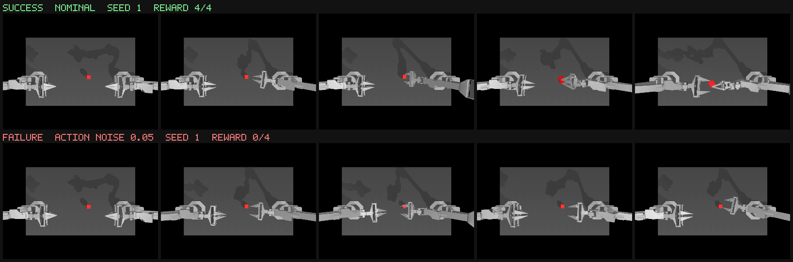

# VLA target — feasibility spike (pi0 + ALOHA sim)

A time-boxed spike asking one question: can a real Physical Intelligence pi-family
vision-language-action policy be a Tail Bazaar target — driven in simulation, perturbed until it
fails, with the failure bound to evidence a verifier could re-run?

**Answer: the policy runs and the perturbation works. The verification story does not.** The
reproducibility finding below is the result that matters, and it is negative.

---

## 1. This is ALOHA sim standing in for YAM

Justin asked for YAM arms. **openpi has no YAM support.** A word-boundary grep for `yam` and `i2rt`
across the whole repository at the commit below, excluding `.venv` and `third_party`, returns zero
hits. YAM is an I2RT bimanual hardware arm; there is no MuJoCo model for it here, and a robot cannot
be simulated without a model.

So this uses openpi's own documented simulation example — `examples/aloha_sim`, a bimanual ALOHA
(ViperX 300 S) pair in MuJoCo on the transfer-cube task. **Every number below is ALOHA sim. None of
it is YAM, and none of it transfers to YAM hardware.** The same harness would point at a YAM sim the
day one exists; nothing in `vla/` is ALOHA-specific except the body and geom names.

## 2. Provenance

| What | Value |
| --- | --- |
| Code | https://github.com/Physical-Intelligence/openpi @ `215abfb217dbac7d5f1273282331b9b1866c0479` |
| Checkpoint | `gs://openpi-assets/checkpoints/pi0_aloha_sim` |
| Checkpoint size | 11.2 GiB (22 objects), published 2025-05-28 |
| Training config | `pi0_aloha_sim` (`src/openpi/training/config.py`) |
| Policy | pi0, JAX, bf16, served by `scripts/serve_policy.py --env ALOHA_SIM` |
| Environment | `gym-aloha` `AlohaTransferCube-v0`, MuJoCo 2.3.7, dm-control 1.0.14 |
| Licence | Apache-2.0 (openpi code and its released checkpoints); gym-aloha Apache-2.0 |
| Hardware | Lambda Cloud, 1x NVIDIA A10 24 GB, driver 570.148.08, CUDA 12.8 |

On checksums: Google Cloud Storage exposes **CRC32C and MD5 per object**, not SHA-256 — e.g. the
`params` manifest object is `crc32c=SGdLxw==`, `md5=JOieaBQUGEJhpCLd9Q5NRw==`. A SHA-256 over the
full 11.2 GiB tree was not computed inside the time box. If a marketplace ever pins this checkpoint,
that tree hash is the thing to pin, and it needs to be computed once and stored.

Nothing here is trained or fine-tuned. The checkpoint is used exactly as published.

## 3. Does the policy actually do the task? Yes — 4 times in 6

Read from the environment's own success signal and nothing else. `gym_aloha`'s `TransferCubeTask`
defines `max_reward = 4` (cube held by the left gripper and clear of the table), and
`AlohaEnv.step` sets `terminated = is_success = (reward == 4)`.

```
seed 0  DROPPED         max_reward 2/4   300 steps
seed 1  SUCCESS         max_reward 4/4   232 steps
seed 2  NOT_COMPLETED   max_reward 0/4   300 steps
seed 3  SUCCESS         max_reward 4/4   215 steps
seed 4  SUCCESS         max_reward 4/4   253 steps
seed 5  SUCCESS         max_reward 4/4   264 steps
```

**NOMINAL SUCCESS RATE: 4/6 (67%)** over 153.6 s, ~25.6 s per episode.
Raw: `nominal_suite.json`. Videos: `nominal_seed*.mp4`.

| Measurement | Value |
| --- | --- |
| Inference latency, warm median | **165–166 ms** per policy call |
| First call in a cold server | ~14.5 s (JAX JIT compile), then steady |
| Policy calls per episode | 30 (action horizon 10, 300 control ticks at 50 Hz) |
| GPU memory | **19,483 MiB / 23,028 MiB** with `XLA_PYTHON_CLIENT_MEM_FRACTION=0.85` |
| Disk added | ~21 GB (12 GB checkpoint cache, 9.1 GB code + two venvs) |

It fits on one A10 comfortably and needed no smaller or lower-precision variant.

**A 67% baseline is itself a finding.** A target that fails a third of its unperturbed episodes
cannot support the claim "this perturbation broke it" from a single episode. Every search below is
therefore *paired*: the control set is only the seeds that reached the environment's success signal
at nominal (`{1, 3, 4, 5}`), and a failure counts only when such a seed flips to non-SUCCESS.

## 4. A bounded perturbation does make it fail

One axis moved, everything else nominal, same four control seeds.

| `action_noise` | Control seeds failing | Outcomes |
| --- | --- | --- |
| 0.00 (nominal) | 0 / 4 | all SUCCESS |
| 0.01 | 2 / 4 | 1 DROPPED, 1 NOT_COMPLETED |
| **0.02** | **4 / 4** | 3 DROPPED, 1 NOT_COMPLETED |
| 0.05 | 4 / 4 | 4 NOT_COMPLETED, all `max_reward 0/4` |

The axis is Gaussian noise on each of the 14 commanded joint positions, per control tick. **The
boundary sits between 0.01 and 0.02** — roughly 0.6 to 1.1 degrees of per-joint jitter. At 0.05 the
policy stops touching the cube at all (`max_reward 0/4`): it never even reaches reward 1.

Search cost: **8 episodes, 220.2 s** of A10 time for the finding at 0.02 (plus 4 episodes / 110.2 s
for the earlier coarse pass). Raw: `search.json`, `search_coarse.json`.

Outcome classes are `SUCCESS` / `DROPPED` / `NOT_COMPLETED` / `INCONCLUSIVE`. `DROPPED` uses one
documented mechanical predicate on top of the env's signal — the cube must have been genuinely
lifted (the task's own reward >= 2) and then `red_box` re-contacts `table` while touching neither
gripper finger. Severity is a measured quantity, not a score: cube impact speed at that contact
(e.g. 0.082 m/s for seed 1 at `action_noise=0.02`) plus drop height.



Same seed, same checkpoint, one axis moved. Top: the nominal run — the right arm reaches, grasps,
and transfers the cube. Bottom: `action_noise=0.05` — the arms move but never close on the cube,
which sits on the table for all 300 ticks. Sources: `nominal_seed1.mp4`,
`failure_seed1_noise05.mp4`.

## 5. Reproducibility: this is where it breaks

**Same seed, same nominal configuration, run twice, back to back, same warm server:**

```
rep 0   seed 1   SUCCESS   max_reward 4/4   229 steps
rep 1   seed 1   DROPPED   max_reward 2/4   300 steps
```

```
action_digest_match:   False
obs_digest_match:      False
reward_trace_match:    False
box_z_trace_match:     False
outcome_match:         False
first_divergent_step:  129
```

Raw: `determinism.json`.

Not merely "not bit-identical" — **the outcome class itself flipped.** Two identical invocations
gave a success and a drop, diverging at control tick 129 of 300.

Two independent causes, both documented upstream rather than inferred:

1. **The environment.** `gym-aloha` registers these envs with `nondeterministic=True`, with the
   comment "Even after seeding, the rendered observations are slightly different". The rendered
   image is the policy's only exteroceptive input, so a pixel difference is a different observation.
2. **The policy.** pi0 inference runs in JAX in bf16 on the A10, where kernel reduction order is not
   pinned across runs.

These compound: a sub-LSB pixel difference changes the action slightly, which changes the next
observation, and by tick 129 the trajectories have separated enough to change whether the cube ends
up in the left gripper.

### What this costs the marketplace

The Tail Bazaar verifier binds a sold failure to a re-run. **This target cannot support that
contract in its current form.** A buyer who re-runs a scenario may legitimately get SUCCESS.

What *is* reproducible, and is recorded per episode:

- the seed, the sampled cube pose, and every axis value — the scenario is fully specified;
- SHA-256 of the observation stream and SHA-256 of the realised action trace, so two runs can be
  *compared* even though they cannot be *matched*;
- per-frame world transforms for both arms, both grippers' fingers and the cube, decimated to 10 Hz,
  so the existing Three.js viewer could replay a recorded episode without re-running the policy.

Three honest options, none of which fit in this spike:

1. **Sell the distribution, not the episode.** Ship N paired episodes and a failure *rate* at the
   perturbed point versus nominal. The 4/4-vs-4/4 result above is already this shape, and at a 67%
   baseline the probability of four independent nominal failures is about 1.2%.
2. **Replay open-loop from the recorded action trace.** Deterministic and cheap — it re-runs MuJoCo
   without the policy — but it verifies the *recording*, not the policy, so it cannot detect a
   fabricated trace.
3. **Verdict `INCONCLUSIVE` on re-run mismatch**, which is honest but makes the listing much weaker.

Anything sold off this target must say on the listing that the target is stochastic. Presenting a
single pi0 episode as a reproducible failure would be misleading.

## 6. Files

| File | What |
| --- | --- |
| `nominal_suite.json` | 6 unperturbed episodes, full traces, the 4/6 baseline |
| `search.json` | Paired ladder, the `action_noise=0.02` finding, search cost |
| `search_coarse.json` | Earlier coarse pass that found `action_noise=0.05` |
| `determinism.json` | The two identical runs that disagree, with digests |
| `failure_seed1_noise05.json` | The failure episode in the filmstrip |
| `smoke.json` | First end-to-end episode, kept as the install's proof of life |
| `nominal_seed*.mp4` | Recorded nominal episodes |
| `failure_seed1_noise05.mp4` | Recorded perturbed failure |
| `success_vs_failure.png` | The filmstrip above |

Each episode JSON carries `reward_trace`, `box_z_trace`, `replay.frames` (body transforms at 10 Hz),
`action_digest`, `obs_digest`, and the measured latencies.

Harness: `vla/`. Envelope: `vla/envelope-vla.yaml`. Reproduce: `vla/README.md`.

## 7. What was not done

- **No YAM.** No model exists in openpi; see section 1.
- **No SHA-256 of the checkpoint tree** (GCS gives CRC32C/MD5 only; 11.2 GiB to hash).
- **Only `action_noise` was searched to a boundary.** `latency_steps`, `box_mass_scale`,
  `box_friction_scale` and `cam_dz` are implemented and in the envelope but were not run — the
  ladder exists, it was not climbed.
- **No repeat-based baseline.** Given section 5, the honest baseline is a per-seed success *rate*
  over many repeats, not one episode per seed. That is the first thing to do next, and it is what
  would tell us whether the `action_noise` boundary is where it looks.
- **No marketplace integration.** Nothing here is wired into `web/` or `contracts/`.
